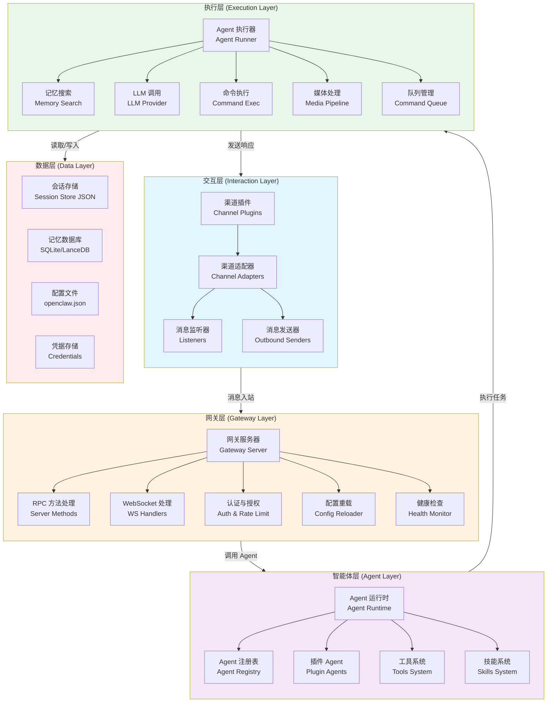
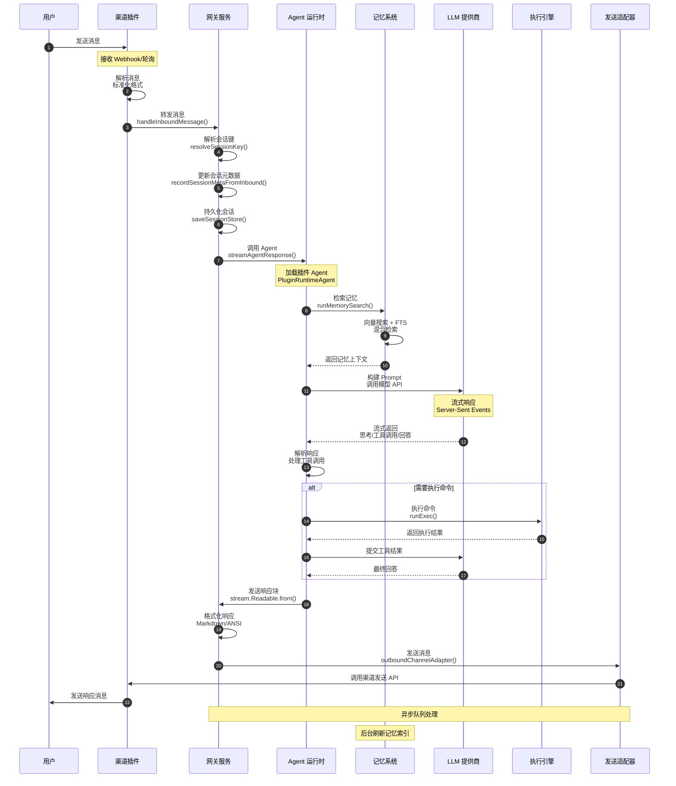
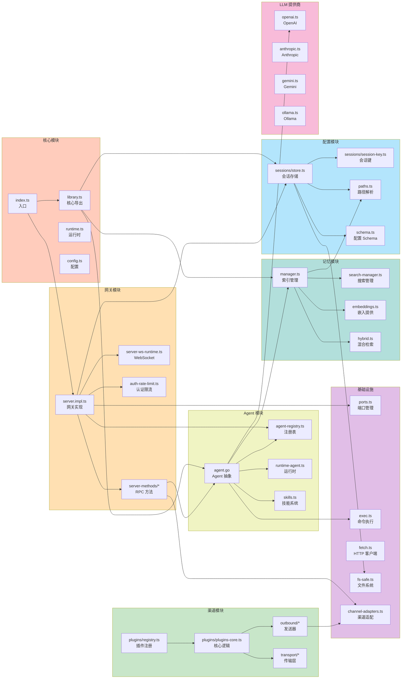
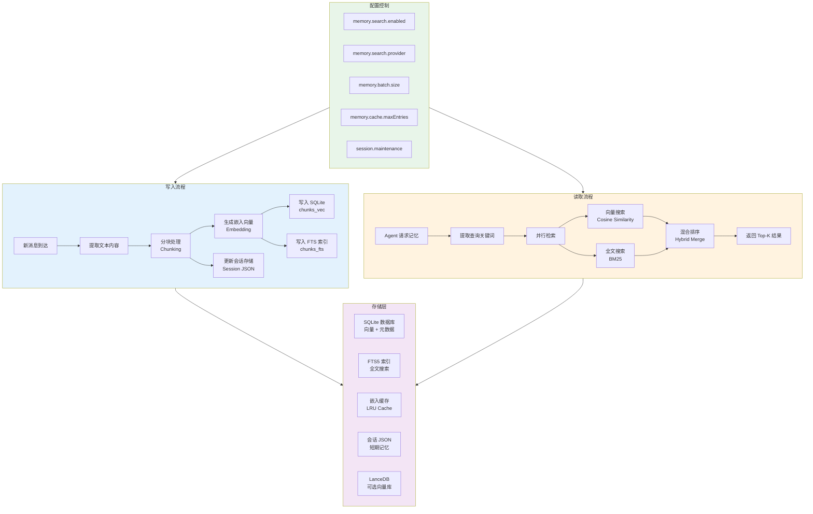
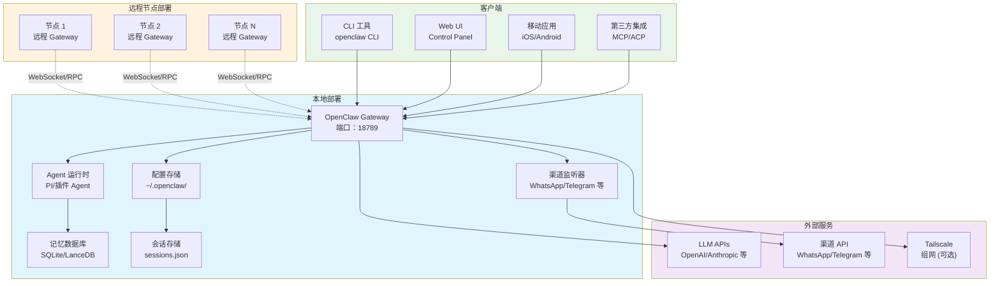

```mermaid
C4Context
  title OpenClaw 系统上下文图

  Person(user, "用户", "通过消息渠道发送消息的终端用户")
  Person(admin, "管理员", "配置和管理 OpenClaw 系统的运维人员")

  System_Boundary(openclaw, "OpenClaw 系统") {
    System(gateway, "网关服务", "OpenClaw Gateway", "核心服务，处理消息路由、Agent 管理和插件加载")
    System(channels, "渠道系统", "Channel Plugins", "消息渠道适配层")
    System(agents, "Agent 系统", "Agent Runtime", "智能体执行引擎")
    System(memory, "记忆系统", "Memory System", "三级记忆存储与检索")
    System(config, "配置系统", "Configuration", "配置和会话管理")
  }

  System_Ext(whatsapp, "WhatsApp", "Meta", "消息渠道")
  System_Ext(telegram, "Telegram", "Telegram", "消息渠道")
  System_Ext(discord, "Discord", "Discord", "消息渠道")
  System_Ext(slack, "Slack", "Salesforce", "消息渠道")
  System_Ext(imessage, "iMessage", "Apple", "消息渠道")
  System_Ext(signal, "Signal", "Signal Foundation", "消息渠道")
  System_Ext(line, "LINE", "LY Corporation", "消息渠道")
  System_Ext(zalo, "Zalo", "VNG Corporation", "消息渠道")

  System_Ext(openai, "OpenAI API", "OpenAI", "LLM 服务提供商")
  System_Ext(anthropic, "Anthropic API", "Anthropic", "LLM 服务提供商")
  System_Ext(gemini, "Google Gemini", "Google", "LLM 服务提供商")
  System_Ext(qwen, "Qwen API", "Alibaba", "LLM 服务提供商")
  System_Ext(ollama, "Ollama", "本地", "本地 LLM 运行")

  System_Ext(filesystem, "文件系统", "本地/远程", "存储会话、记忆、配置")
  System_Ext(remote_node, "远程节点", "OpenClaw Node", "分布式节点")

  Rel(user, whatsapp, "发送/接收消息")
  Rel(user, telegram, "发送/接收消息")
  Rel(user, discord, "发送/接收消息")
  Rel(user, slack, "发送/接收消息")
  Rel(user, imessage, "发送/接收消息")
  Rel(user, signal, "发送/接收消息")
  Rel(user, line, "发送/接收消息")
  Rel(user, zalo, "发送/接收消息")

  Rel(whatsapp, channels, "Webhook/Polling", "HTTPS")
  Rel(telegram, channels, "Webhook/Polling", "HTTPS")
  Rel(discord, channels, "Gateway API", "WebSocket")
  Rel(slack, channels, "Events API", "HTTPS")
  Rel(imessage, channels, "AppleScript/DB", "本地 IPC")
  Rel(signal, channels, "Signal CLI", "本地 IPC")
  Rel(line, channels, "Webhook", "HTTPS")
  Rel(zalo, channels, "Webhook", "HTTPS")

  Rel(channels, gateway, "消息转发", "内部 API")
  Rel(gateway, agents, "调用执行", "内部 API")
  Rel(agents, memory, "读写记忆", "SQLite/LanceDB")
  Rel(gateway, config, "加载配置", "JSON")
  Rel(config, filesystem, "持久化", "JSON/SQLite")

  Rel(agents, openai, "调用模型", "HTTPS API")
  Rel(agents, anthropic, "调用模型", "HTTPS API")
  Rel(agents, gemini, "调用模型", "HTTPS API")
  Rel(agents, qwen, "调用模型", "HTTPS API")
  Rel(agents, ollama, "调用模型", "HTTP")

  Rel(admin, gateway, "配置管理", "CLI/Web")
  Rel(gateway, remote_node, "节点通信", "WebSocket/RPC")
  Rel(remote_node, filesystem, "分布式存储", "网络")

  UpdateRelStyle(user, whatsapp, $offsetY="-60")
  UpdateRelStyle(user, telegram, $offsetY="-40")
  UpdateRelStyle(user, discord, $offsetY="-20")
  UpdateRelStyle(user, slack, $offsetY="0")
  UpdateRelStyle(user, imessage, $offsetY="20")
  UpdateRelStyle(user, signal, $offsetY="40")
  UpdateRelStyle(user, line, $offsetY="60")
  UpdateRelStyle(user, zalo, $offsetY="80")

  UpdateLayoutConfig($c4ShapeInRow="4", $c4BoundaryInRow="1")
```

# OpenClaw 架构图系列

**项目版本**: 2026.3.14  
**分析日期**: 2026-03-18  
**分析范围**: src/, config/, extensions/, package.json

---

## 图 1：系统上下文图 (System Context Diagram)

### 说明

展示 OpenClaw 与外部系统的交互关系，包括支持的消息渠道、LLM 服务提供商、文件系统和本地/远程节点。

### 架构图

### 关键组件映射

| 图中组件   | 源文件路径                                                                                               | 说明              |
| ---------- | -------------------------------------------------------------------------------------------------------- | ----------------- |
| 网关服务   | [`src/gateway/server.impl.ts`](file:///Users/zhuzy/zhuzy/kitz-openclaw/src/gateway/server.impl.ts)       | 核心网关实现      |
| 渠道系统   | [`src/channels/plugins/index.ts`](file:///Users/zhuzy/zhuzy/kitz-openclaw/src/channels/plugins/index.ts) | 渠道插件注册表    |
| Agent 系统 | [`src/agents/agent.go`](file:///Users/zhuzy/zhuzy/kitz-openclaw/src/agents/agent.go)                     | Agent 抽象与执行  |
| 记忆系统   | [`src/memory/manager.ts`](file:///Users/zhuzy/zhuzy/kitz-openclaw/src/memory/manager.ts)                 | 记忆索引管理      |
| 配置系统   | [`src/config/config.ts`](file:///Users/zhuzy/zhuzy/kitz-openclaw/src/config/config.ts)                   | 配置加载          |
| WhatsApp   | [`extensions/whatsapp`](file:///Users/zhuzy/zhuzy/kitz-openclaw/extensions/whatsapp)                     | WhatsApp 渠道插件 |
| Telegram   | [`extensions/telegram`](file:///Users/zhuzy/zhuzy/kitz-openclaw/extensions/telegram)                     | Telegram 渠道插件 |
| Discord    | [`extensions/discord`](file:///Users/zhuzy/zhuzy/kitz-openclaw/extensions/discord)                       | Discord 渠道插件  |

---

## 图 2：四层架构总览图 (Four-Layer Architecture)

### 说明

展示 OpenClaw 的四层架构模型：交互层、网关层、智能体层、执行层，以及各层之间的调用关系。

### 架构图

### 关键组件映射

| 层级     | 组件         | 源文件路径                                                                                                                 |
| -------- | ------------ | -------------------------------------------------------------------------------------------------------------------------- |
| 交互层   | 渠道插件     | [`src/channels/plugins/registry.ts`](file:///Users/zhuzy/zhuzy/kitz-openclaw/src/channels/plugins/registry.ts)             |
| 交互层   | 渠道适配器   | [`src/infra/outbound/channel-adapters.ts`](file:///Users/zhuzy/zhuzy/kitz-openclaw/src/infra/outbound/channel-adapters.ts) |
| 交互层   | 消息监听     | [`src/interaction/connector.go`](file:///Users/zhuzy/zhuzy/kitz-openclaw/src/interaction/connector.go)                     |
| 网关层   | 网关服务器   | [`src/gateway/server.impl.ts`](file:///Users/zhuzy/zhuzy/kitz-openclaw/src/gateway/server.impl.ts)                         |
| 网关层   | RPC 方法     | [`src/gateway/server-methods/agent.ts`](file:///Users/zhuzy/zhuzy/kitz-openclaw/src/gateway/server-methods/agent.ts)       |
| 网关层   | WebSocket    | [`src/gateway/server-ws-runtime.ts`](file:///Users/zhuzy/zhuzy/kitz-openclaw/src/gateway/server-ws-runtime.ts)             |
| 智能体层 | Agent 运行时 | [`src/plugins/runtime/runtime-agent.ts`](file:///Users/zhuzy/zhuzy/kitz-openclaw/src/plugins/runtime/runtime-agent.ts)     |
| 智能体层 | Agent 注册表 | [`src/agents/agent-registry.ts`](file:///Users/zhuzy/zhuzy/kitz-openclaw/src/agents/agent-registry.ts)                     |
| 执行层   | Agent 执行器 | [`src/auto-reply/reply/agent-runner.ts`](file:///Users/zhuzy/zhuzy/kitz-openclaw/src/auto-reply/reply/agent-runner.ts)     |
| 执行层   | 记忆搜索     | [`src/memory/manager.ts`](file:///Users/zhuzy/zhuzy/kitz-openclaw/src/memory/manager.ts)                                   |
| 执行层   | LLM 调用     | [`src/providers/`](file:///Users/zhuzy/zhuzy/kitz-openclaw/src/providers/)                                                 |
| 数据层   | 会话存储     | [`src/config/sessions/store.ts`](file:///Users/zhuzy/zhuzy/kitz-openclaw/src/config/sessions/store.ts)                     |
| 数据层   | 配置文件     | [`src/config/config.ts`](file:///Users/zhuzy/zhuzy/kitz-openclaw/src/config/config.ts)                                     |

---

## 图 3：消息流程序列图 (Message Flow Sequence)

### 说明

追踪用户消息从发送到响应的完整链路，展示各层之间的同步/异步调用关系。

### 架构图

### 关键调用链路

| 步骤 | 方法名                           | 源文件路径                                                                                                                           |
| ---- | -------------------------------- | ------------------------------------------------------------------------------------------------------------------------------------ |
| 2    | `listenAndForward()`             | [`src/interaction/connector.go`](file:///Users/zhuzy/zhuzy/kitz-openclaw/src/interaction/connector.go)                               |
| 3-4  | `handleInboundMessage()`         | [`src/gateway/server-chat.ts`](file:///Users/zhuzy/zhuzy/kitz-openclaw/src/gateway/server-chat.ts)                                   |
| 5    | `resolveSessionKey()`            | [`src/config/sessions/session-key.ts`](file:///Users/zhuzy/zhuzy/kitz-openclaw/src/config/sessions/session-key.ts)                   |
| 6    | `recordSessionMetaFromInbound()` | [`src/config/sessions/store.ts`](file:///Users/zhuzy/zhuzy/kitz-openclaw/src/config/sessions/store.ts)                               |
| 8    | `streamAgentResponse()`          | [`src/gateway/server-methods/agents.ts`](file:///Users/zhuzy/zhuzy/kitz-openclaw/src/gateway/server-methods/agents.ts)               |
| 10   | `runMemorySearch()`              | [`src/auto-reply/reply/agent-runner-memory.ts`](file:///Users/zhuzy/zhuzy/kitz-openclaw/src/auto-reply/reply/agent-runner-memory.ts) |
| 13   | `runReplyAgent()`                | [`src/auto-reply/reply/agent-runner.ts`](file:///Users/zhuzy/zhuzy/kitz-openclaw/src/auto-reply/reply/agent-runner.ts)               |
| 18   | `outboundChannelAdapter()`       | [`src/infra/outbound/channel-adapters.ts`](file:///Users/zhuzy/zhuzy/kitz-openclaw/src/infra/outbound/channel-adapters.ts)           |

---

## 图 4：模块依赖图 (Module Dependency Graph)

### 说明

展示 src/ 目录下核心模块的导入依赖关系，识别核心模块和边缘模块。

### 架构图

### 模块分类

| 类别 | 模块                     | LOC 估算 | 依赖数 |
| ---- | ------------------------ | -------- | ------ |
| 核心 | index.ts, library.ts     | ~100     | 5+     |
| 核心 | gateway/server.impl.ts   | ~800     | 20+    |
| 核心 | agents/agent.go          | ~600     | 15+    |
| 核心 | config/sessions/store.ts | ~700     | 10+    |
| 核心 | memory/manager.ts        | ~900     | 12+    |
| 边缘 | channels/transport/\*    | ~200     | 3-5    |
| 边缘 | infra/binaries.ts        | ~150     | 2-3    |

---

## 图 5：记忆系统数据流图 (Memory System Data Flow)

### 说明

展示三级记忆系统（短期会话记忆、长期记忆索引、语义记忆嵌入）的读写流程。

### 架构图

### 数据结构

| 数据表          | 字段                              | 用途     |
| --------------- | --------------------------------- | -------- |
| chunks_vec      | id, chunk_id, embedding, metadata | 向量存储 |
| chunks_fts      | chunk_id, text, session_id        | 全文索引 |
| embedding_cache | text_hash, embedding, provider    | 嵌入缓存 |
| sessions.json   | sessionId, updatedAt, messages    | 会话存储 |

### 关键文件路径

| 组件           | 源文件路径                                                                                                                           |
| -------------- | ------------------------------------------------------------------------------------------------------------------------------------ |
| 记忆管理器     | [`src/memory/manager.ts`](file:///Users/zhuzy/zhuzy/kitz-openclaw/src/memory/manager.ts)                                             |
| 搜索管理       | [`src/memory/search-manager.ts`](file:///Users/zhuzy/zhuzy/kitz-openclaw/src/memory/search-manager.ts)                               |
| 嵌入提供       | [`src/memory/embeddings.ts`](file:///Users/zhuzy/zhuzy/kitz-openclaw/src/memory/embeddings.ts)                                       |
| 混合检索       | [`src/memory/hybrid.ts`](file:///Users/zhuzy/zhuzy/kitz-openclaw/src/memory/hybrid.ts)                                               |
| 会话存储       | [`src/config/sessions/store.ts`](file:///Users/zhuzy/zhuzy/kitz-openclaw/src/config/sessions/store.ts)                               |
| Agent 记忆集成 | [`src/auto-reply/reply/agent-runner-memory.ts`](file:///Users/zhuzy/zhuzy/kitz-openclaw/src/auto-reply/reply/agent-runner-memory.ts) |

---

## 图 6：部署拓扑图 (Deployment Topology)

### 说明

展示本地运行和分布式节点部署的拓扑结构，包括网络端口和通信协议。

### 架构图

### 网络端口

| 端口  | 协议      | 用途         |
| ----- | --------- | ------------ |
| 18789 | HTTP/WS   | 网关默认端口 |
| 443   | HTTPS     | 渠道 Webhook |
| 动态  | WebSocket | 远程节点通信 |

### 配置文件路径

| 配置类型   | 路径                                     |
| ---------- | ---------------------------------------- |
| 主配置     | `~/.openclaw/openclaw.json`              |
| 会话存储   | `~/.openclaw/sessions.json`              |
| 凭据存储   | `~/.openclaw/credentials/`               |
| 记忆数据库 | `~/.openclaw/agents/<agentId>/memory.db` |
| 日志文件   | `~/.openclaw/logs/`                      |

### 关键文件路径

| 组件           | 源文件路径                                                                                                   |
| -------------- | ------------------------------------------------------------------------------------------------------------ |
| 网关启动       | [`src/gateway/server.impl.ts`](file:///Users/zhuzy/zhuzy/kitz-openclaw/src/gateway/server.impl.ts)           |
| 节点注册       | [`src/gateway/node-registry.ts`](file:///Users/zhuzy/zhuzy/kitz-openclaw/src/gateway/node-registry.ts)       |
| 配置加载       | [`src/config/config.ts`](file:///Users/zhuzy/zhuzy/kitz-openclaw/src/config/config.ts)                       |
| 路径解析       | [`src/config/paths.ts`](file:///Users/zhuzy/zhuzy/kitz-openclaw/src/config/paths.ts)                         |
| Tailscale 集成 | [`src/gateway/server-tailscale.ts`](file:///Users/zhuzy/zhuzy/kitz-openclaw/src/gateway/server-tailscale.ts) |

---

## 附加分析

### 架构设计原则总结

#### 1. 解耦方式

- **插件化架构**: 渠道和 Agent 都通过插件系统实现，支持热插拔
  - 渠道插件：[`src/channels/plugins/registry.ts`](file:///Users/zhuzy/zhuzy/kitz-openclaw/src/channels/plugins/registry.ts)
  - Agent 插件：[`src/plugins/runtime/runtime-agent.ts`](file:///Users/zhuzy/zhuzy/kitz-openclaw/src/plugins/runtime/runtime-agent.ts)

- **适配器模式**: 通过适配器统一不同渠道的接口差异
  - 渠道适配器：[`src/infra/outbound/channel-adapters.ts`](file:///Users/zhuzy/zhuzy/kitz-openclaw/src/infra/outbound/channel-adapters.ts)

- **事件驱动**: 使用事件系统解耦组件间通信
  - Agent 事件：[`src/infra/agent-events.ts`](file:///Users/zhuzy/zhuzy/kitz-openclaw/src/infra/agent-events.ts)

#### 2. 扩展机制

- **插件 SDK**: 提供完整的插件开发 SDK
  - 插件 SDK 导出：`src/plugin-sdk/` 目录
  - 支持渠道插件、Agent 插件、工具插件

- **技能系统**: 支持动态加载远程技能
  - 技能刷新：[`src/agents/skills/refresh.ts`](file:///Users/zhuzy/zhuzy/kitz-openclaw/src/agents/skills/refresh.ts)

#### 3. 数据流设计

- **单向数据流**: 消息从渠道 → 网关 → Agent → 执行层单向流动
- **异步队列**: 使用命令队列处理异步任务
  - 命令队列：[`src/process/command-queue.ts`](file:///Users/zhuzy/zhuzy/kitz-openclaw/src/process/command-queue.ts)

- **流式处理**: 支持 LLM 响应的流式传输
  - 流式响应：[`src/gateway/server-methods/agents.ts`](file:///Users/zhuzy/zhuzy/kitz-openclaw/src/gateway/server-methods/agents.ts)

#### 4. 安全考虑

- **认证限流**: 网关连接认证和速率限制
  - 认证限流：[`src/gateway/auth-rate-limit.ts`](file:///Users/zhuzy/zhuzy/kitz-openclaw/src/gateway/auth-rate-limit.ts)

- **Secrets 管理**: 凭据加密存储和运行时注入
  - Secrets 运行时：[`src/secrets/runtime.ts`](file:///Users/zhuzy/zhuzy/kitz-openclaw/src/secrets/runtime.ts)

- **SSRF 防护**: 内网请求保护
  - SSRF 防护：[`src/infra/net/ssrf.ts`](file:///Users/zhuzy/zhuzy/kitz-openclaw/src/infra/net/ssrf.ts)

---

### 源码学习路径建议

#### 第一周：基础架构理解

1. **入口和启动流程**
   - [`src/index.ts`](file:///Users/zhuzy/zhuzy/kitz-openclaw/src/index.ts) - 程序入口
   - [`src/cli/run-main.ts`](file:///Users/zhuzy/zhuzy/kitz-openclaw/src/cli/run-main.ts) - CLI 启动
   - [`src/gateway/server.impl.ts`](file:///Users/zhuzy/zhuzy/kitz-openclaw/src/gateway/server.impl.ts) - 网关启动

2. **配置系统**
   - [`src/config/config.ts`](file:///Users/zhuzy/zhuzy/kitz-openclaw/src/config/config.ts) - 配置加载
   - [`src/config/sessions/store.ts`](file:///Users/zhuzy/zhuzy/kitz-openclaw/src/config/sessions/store.ts) - 会话存储

3. **网关基础**
   - [`src/gateway/server-methods-list.ts`](file:///Users/zhuzy/zhuzy/kitz-openclaw/src/gateway/server-methods-list.ts) - RPC 方法列表
   - [`src/gateway/server-ws-runtime.ts`](file:///Users/zhuzy/zhuzy/kitz-openclaw/src/gateway/server-ws-runtime.ts) - WebSocket 处理

#### 第二周：核心功能深入

1. **渠道系统**
   - [`src/channels/plugins/registry.ts`](file:///Users/zhuzy/zhuzy/kitz-openclaw/src/channels/plugins/registry.ts) - 渠道插件注册
   - [`src/channels/plugins/plugins-core.ts`](file:///Users/zhuzy/zhuzy/kitz-openclaw/src/channels/plugins/plugins-core.ts) - 渠道核心逻辑
   - 选择一个具体渠道插件深入研究（如 WhatsApp/Telegram）

2. **Agent 系统**
   - [`src/agents/agent.go`](file:///Users/zhuzy/zhuzy/kitz-openclaw/src/agents/agent.go) - Agent 抽象
   - [`src/plugins/runtime/runtime-agent.ts`](file:///Users/zhuzy/zhuzy/kitz-openclaw/src/plugins/runtime/runtime-agent.ts) - 插件 Agent 运行时
   - [`src/auto-reply/reply/agent-runner.ts`](file:///Users/zhuzy/zhuzy/kitz-openclaw/src/auto-reply/reply/agent-runner.ts) - Agent 执行器

3. **记忆系统**
   - [`src/memory/manager.ts`](file:///Users/zhuzy/zhuzy/kitz-openclaw/src/memory/manager.ts) - 记忆索引管理
   - [`src/memory/search-manager.ts`](file:///Users/zhuzy/zhuzy/kitz-openclaw/src/memory/search-manager.ts) - 记忆搜索
   - [`src/auto-reply/reply/agent-runner-memory.ts`](file:///Users/zhuzy/zhuzy/kitz-openclaw/src/auto-reply/reply/agent-runner-memory.ts) - 记忆与 Agent 集成

#### 第三周：高级特性和扩展

1. **插件开发**
   - 阅读 `src/plugin-sdk/` 下的 SDK 定义
   - 研究一个现有插件的实现（如 `extensions/` 目录）

2. **工具系统**
   - [`src/agents/tools/`](file:///Users/zhuzy/zhuzy/kitz-openclaw/src/agents/tools/) - 工具实现
   - 理解工具调用机制

3. **分布式部署**
   - [`src/gateway/node-registry.ts`](file:///Users/zhuzy/zhuzy/kitz-openclaw/src/gateway/node-registry.ts) - 节点管理
   - [`src/gateway/server-tailscale.ts`](file:///Users/zhuzy/zhuzy/kitz-openclaw/src/gateway/server-tailscale.ts) - Tailscale 集成

---

### 潜在风险点

#### 1. 单点故障

- **网关服务**: 单一网关实例处理所有消息，网关宕机导致全系统不可用
  - 缓解：支持远程节点部署，但主节点仍是单点
- **会话存储**: sessions.json 单文件存储，文件损坏导致会话丢失
  - 位置：[`src/config/sessions/store.ts`](file:///Users/zhuzy/zhuzy/kitz-openclaw/src/config/sessions/store.ts)

#### 2. 性能瓶颈

- **记忆检索**: 每次 Agent 调用都进行记忆检索，可能成为性能瓶颈
  - 优化：嵌入缓存、批量处理
  - 位置：[`src/memory/manager.ts`](file:///Users/zhuzy/zhuzy/kitz-openclaw/src/memory/manager.ts)

- **会话写入**: 每次消息都触发会话存储写入和锁竞争
  - 位置：[`src/config/sessions/store.ts:404-573`](file:///Users/zhuzy/zhuzy/kitz-openclaw/src/config/sessions/store.ts#L404-L573)

- **渠道轮询**: 多个渠道同时轮询可能占用大量资源

#### 3. 安全隐患

- **凭据存储**: 凭据存储在本地文件系统，依赖文件系统权限保护
  - 位置：`~/.openclaw/credentials/`

- **Webhook 验证**: 部分渠道 Webhook 签名验证可能不严格
  - 需检查各渠道的 webhook 处理逻辑

- **命令执行**: Agent 可执行系统命令，存在注入风险
  - 缓解：命令审批机制 [`src/gateway/exec-approval-manager.ts`](file:///Users/zhuzy/zhuzy/kitz-openclaw/src/gateway/exec-approval-manager.ts)

#### 4. 循环依赖

基于分析，未发现明显的循环依赖问题。模块依赖关系清晰：

- 基础设施层 → 无依赖
- 配置层 → 依赖基础设施
- 网关层 → 依赖配置层 + 基础设施
- Agent 层 → 依赖网关层 + 记忆系统
- 渠道层 → 依赖基础设施

#### 5. 其他风险

- **内存泄漏**: 长时间运行时，缓存和事件监听器可能导致内存泄漏
  - 记忆索引缓存：[`src/memory/manager.ts:L42-L43`](file:///Users/zhuzy/zhuzy/kitz-openclaw/src/memory/manager.ts#L42-L43)
- **并发写入**: 会话存储的锁机制在高并发下可能成为瓶颈
  - 位置：[`src/config/sessions/store.ts:L585-L680`](file:///Users/zhuzy/zhuzy/kitz-openclaw/src/config/sessions/store.ts#L585-L680)

- **渠道插件兼容性**: 渠道 API 变更可能导致插件失效
  - 缓解：插件版本管理和自动更新机制

---

## 总结

OpenClaw 是一个设计良好的四层架构系统：

1. **交互层**负责与各种消息渠道对接，通过插件化实现高扩展性
2. **网关层**提供统一的 RPC 接口和 WebSocket 通信，是系统的核心枢纽
3. **智能体层**抽象 Agent 接口，支持多种 Agent 实现和插件扩展
4. **执行层**负责实际的任务执行，包括 LLM 调用、记忆检索、命令执行等

系统采用了插件化、事件驱动、流式处理等现代架构模式，支持分布式部署和丰富的扩展机制。主要风险点在于单点故障、性能瓶颈和安全加固，建议在大规模部署时考虑高可用方案。

---

**分析完成时间**: 2026-03-18  
**分析基于版本**: OpenClaw v2026.3.14  
**分析文件总数**: ~200+ TypeScript/Go 文件
