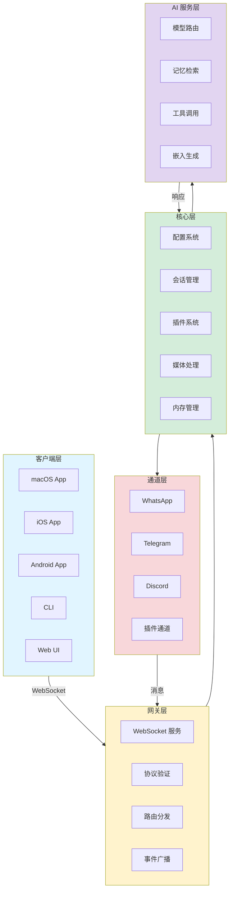
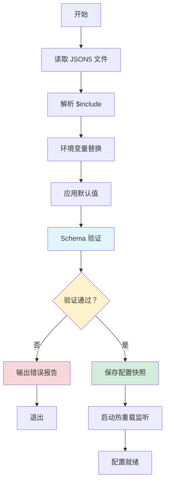
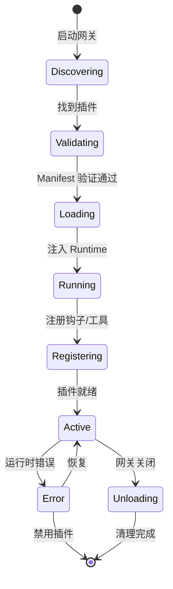
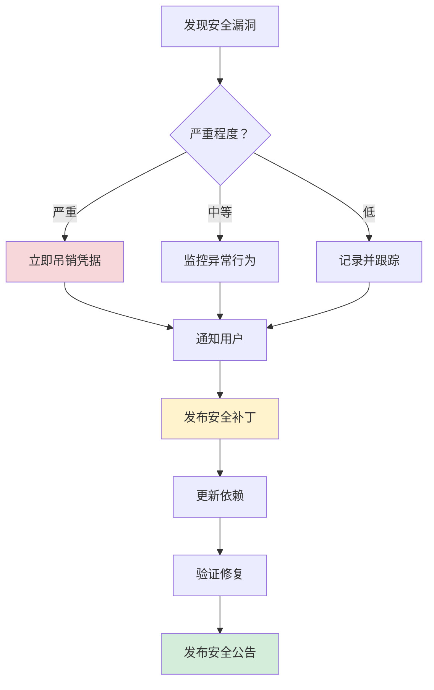
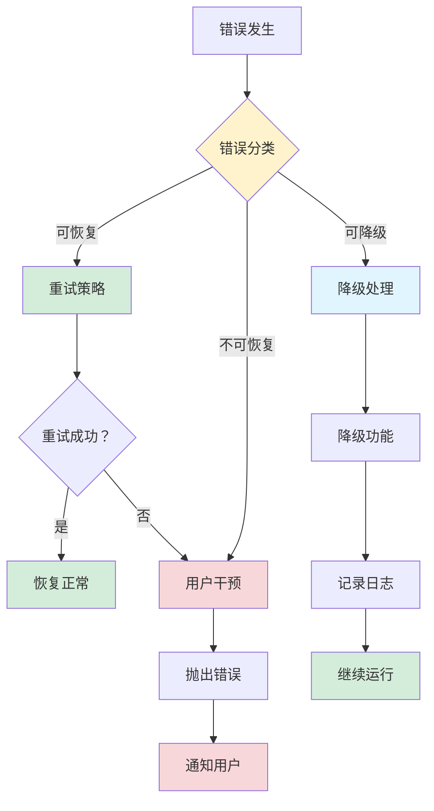

# OpenClaw 编程架构思想合集

> 本文档解构 OpenClaw 项目的核心架构范式，为未来 AI 编程工具提供可复用的架构模式参考。

---

## 文档版本历史

| 版本  | 日期       | 变更内容                                                                   | 作者          |
| ----- | ---------- | -------------------------------------------------------------------------- | ------------- |
| 1.0.0 | 2026-03-03 | 初始版本                                                                   | OpenClaw Team |
| 1.1.0 | 2026-03-04 | 新增错误处理系统章节、优化导航、补充检查清单                               | OpenClaw Team |
| 1.2.0 | 2026-03-04 | 修正章节编号错误、修复 mermaid 图表、添加系统全景架构图、补充性能指标基准  | OpenClaw Team |
| 1.3.0 | 2026-03-04 | 添加快速开始章节、错误处理流程图、安全威胁模型、数据迁移策略、文档维护指南 | OpenClaw Team |
| 1.4.0 | 2026-03-04 | 修正全文索引引用错误（快速导航、快速索引、附录索引、最佳实践索引）         | OpenClaw Team |

**主要变更说明**：

- **v1.4.0**:
  - 修正快速导航中的章节引用错误（新开发者、运维人员、测试工程师）
  - 修正快速索引中的附录编号错误（B.6→B.2、B.7-8→B.3、B.9→B.4）
  - 修正关键词索引中的章节引用（测试、部署、迁移、错误处理）
  - 修正最佳实践索引中的所有章节编号（1.4、3.4、4.4 等）
  - 修正关键决策记录中的 pnpm 引用（18.3.1→20.3.1）
  - 修正按场景阅读中的发布部署章节（15→16）
- **v1.3.0**:
  - 修正第 14/15/17/18 章的章节编号错误
  - 修复网关协议 mermaid 序列图闭合问题
  - 新增系统全景架构图（5 层架构可视化）
  - 补充性能指标基准表
- **v1.1.0**:
  - 新增第 13 章：错误处理系统（错误分类、错误码设计、处理策略）
  - 添加快速导航矩阵（按角色分类）
  - 补充新开发者入职检查清单和代码审查检查清单
  - 更新 FAQ 添加错误处理相关问题
  - 调整章节编号（原 13-18 章 → 14-19 章）
- **v1.0.0**:
  - 初始版本，涵盖 18 个架构主题
  - 包含技术架构和项目管理两大篇章

---

## 目录

### 技术架构篇

1. [配置系统设计](#1-配置系统设计)
2. [CLI 系统架构](#2-cli-系统架构)
3. [插件化架构](#3-插件化架构)
4. [网关通信协议](#4-网关通信协议)
5. [会话管理](#5-会话管理)
6. [重试与容错](#6-重试与容错)
7. [类型安全与 Schema 驱动](#7-类型安全与-schema-驱动)
8. [日志与可观测性](#8-日志与可观测性)
9. [安全与认证](#9-安全与认证)
10. [模块边界与依赖注入](#10-模块边界与依赖注入)
11. [媒体处理架构](#11-媒体处理架构)
12. [内存管理系统](#12-内存管理系统)
13. [错误处理系统](#13-错误处理系统)
14. [数据迁移策略](#14-数据迁移策略)

### 项目管理篇

15. [测试系统架构](#15-测试系统架构)
16. [部署与发布系统](#16-部署与发布系统)
17. [CI/CD 与工作流](#17-cicd-与工作流)
18. [国际化系统](#18-国际化系统)
19. [文档系统](#19-文档系统)
20. [项目管理最佳实践](#20-项目管理最佳实践)

---

## 快速索引

### 常见问题快速定位

| 问题               | 章节                                                   |
| ------------------ | ------------------------------------------------------ |
| 如何添加新通道？   | [3. 插件化架构](#3-插件化架构)                         |
| 如何配置会话？     | [5. 会话管理](#5-会话管理)                             |
| 如何处理媒体文件？ | [11. 媒体处理架构](#11-媒体处理架构)                   |
| 如何设计重试机制？ | [6. 重试与容错](#6-重试与容错)                         |
| 如何定义 Schema？  | [7. 类型安全与 Schema 驱动](#7-类型安全与-schema-驱动) |
| 如何调试网关问题？ | [附录 B.2](#b2-开发实践)                               |
| 如何优化性能？     | [附录 B.3](#b3-性能优化)                               |
| 如何备份配置？     | [附录 B.4](#b4-安全与运维)                             |

### 关键决策记录

- [为什么选择 TypeBox？](#7-类型安全与-schema-驱动)
- [为什么使用 pnpm？](#2031-包管理器选择)
- [插件 vs 核心模块](#b1-架构设计)
- [会话作用域选择](#b1-架构设计)

### 检查清单

- [添加新插件](#c1-添加新插件检查清单)
- [发布前检查](#c2-发布前检查清单)
- [故障排查](#c3-故障排查检查清单)

---

### 快速导航（按角色）

| 角色       | 优先阅读章节                                                                                                                                                                  |
| ---------- | ----------------------------------------------------------------------------------------------------------------------------------------------------------------------------- |
| 新开发者   | [2](#2-cli-系统架构), [10](#10-模块边界与依赖注入), [15](#15-测试系统架构), [20](#20-项目管理最佳实践)                                                                        |
| 插件开发者 | [3](#3-插件化架构), [7](#7-类型安全与-schema-驱动), [10](#10-模块边界与依赖注入), [C.1](#c1-添加新插件检查清单)                                                               |
| 运维人员   | [1](#1-配置系统设计), [4](#4-网关通信协议), [8](#8-日志与可观测性), [16](#16-部署与发布系统), [B.2-B.4](#b2-开发实践)                                                         |
| 架构师     | [1](#1-配置系统设计), [4](#4-网关通信协议), [7](#7-类型安全与-schema-驱动), [10](#10-模块边界与依赖注入), [11](#11-媒体处理架构), [12](#12-内存管理系统), [B.1](#b1-架构设计) |
| 测试工程师 | [6](#6-重试与容错), [15](#15-测试系统架构), [17](#17-cicd-与工作流), [C.2-C.3](#c2-发布前检查清单)                                                                            |

---

## 快速开始

### 预计阅读时间

- **快速浏览**：30 分钟（只看标题、图表和关键概念）
- **完整阅读**：3-4 小时（包含代码示例和最佳实践）
- **深度学习**：1-2 天（实践所有检查清单和示例）

### 5 分钟速览

如果你只有 5 分钟，优先阅读：

1. [系统全景架构](#系统全景架构) - 了解整体架构
2. [1. 配置系统设计](#1-配置系统设计) - 核心基础
3. [7. 类型安全与 Schema 驱动](#7-类型安全与-schema-驱动) - 关键理念

### 按场景阅读

| 场景         | 优先阅读章节                                                                                                                             |
| ------------ | ---------------------------------------------------------------------------------------------------------------------------------------- |
| 添加新功能   | [3. 插件化架构](#3-插件化架构), [7. 类型安全与 Schema 驱动](#7-类型安全与-schema-驱动), [10. 模块边界与依赖注入](#10-模块边界与依赖注入) |
| 排查问题     | [13. 错误处理系统](#13-错误处理系统), [附录 C.3](#c3-故障排查检查清单)                                                                   |
| 发布部署     | [16. 部署与发布系统](#16-部署与发布系统), [17. CI/CD 与工作流](#17-cicd-与工作流), [附录 C.2](#c2-发布前检查清单)                        |
| 性能优化     | [6. 重试与容错](#6-重试与容错), [12. 内存管理系统](#12-内存管理系统), [B.3 性能优化](#b3-性能优化)                                       |
| 安全加固     | [9. 安全与认证](#9-安全与认证), [附录 C.2](#c2-发布前检查清单)                                                                           |
| 新开发者入职 | [2. CLI 系统架构](#2-cli-系统架构), [10. 模块边界与依赖注入](#10-模块边界与依赖注入), [附录 C.4](#c4-新开发者入职检查清单)               |

### 关键概念速查

> **关键概念**：Schema 驱动开发（SDD）
>
> 从 Schema 定义出发，自动生成类型、验证、文档，保证单一来源真实性。使用 TypeBox 定义协议，Zod 验证配置，TypeScript 提供编译时类型。

> **关键概念**：零信任安全
>
> 所有连接需要认证，设备配对机制，本地信任自动批准，远程连接显式授权。默认使用 pairing 策略，禁止未授权访问。

> **关键概念**：插件隔离
>
> 插件与核心代码完全隔离，通过 SDK 提供编译时类型，通过 Runtime 提供运行时能力。禁止插件直接导入核心模块，确保稳定性和安全性。

> ⚠️ **反模式警告**：避免在插件中直接导入 `src/*` 模块，这会破坏插件隔离性。始终使用注入的 Runtime API。

> ⚠️ **反模式警告**：避免 Schema 和类型分离（容易导致不一致）。应从 Schema 推导类型：`type MyType = z.infer<typeof schema>`。

---

## 系统全景架构



**架构层次说明**：

| 层次          | 职责               | 关键组件                              |
| ------------- | ------------------ | ------------------------------------- |
| **客户端层**  | 用户交互界面       | macOS/iOS/Android App、CLI、Web UI    |
| **网关层**    | 连接管理与协议转换 | WebSocket 服务、认证、路由、事件广播  |
| **核心层**    | 核心业务逻辑       | 配置、会话、插件、媒体、内存          |
| **通道层**    | 消息通道适配       | WhatsApp、Telegram、Discord、插件通道 |
| **AI 服务层** | AI 能力集成        | 模型路由、记忆检索、工具调用          |

---

## 1. 配置系统设计

### 1.1 核心理念

**配置即代码，但安全优先**

- 使用 JSON5 支持注释和 trailing commas，提升可读性
- 严格的 Schema 验证：未知 key 会导致启动失败（除 `$schema` 外）
- 支持环境变量替换：`${VAR_NAME}` 语法
- 支持 Secret 引用：env/file/exec 三种来源
- 配置文件分片：`$include` 支持模块化组织

### 1.2 架构层次

```
┌─────────────────────────────────────┐
│         配置读取层 (io.ts)          │
│  - 读取 JSON5 文件                    │
│  - 环境变量替换                      │
│  - $include 解析                      │
│  - 备份轮转                          │
└─────────────────────────────────────┘
                 ↓
┌─────────────────────────────────────┐
│       配置合并层 (merge-*.ts)       │
│  - 深度合并 include 文件               │
│  - 应用运行时覆盖                    │
│  - 路径标准化                        │
└─────────────────────────────────────┘
                 ↓
┌─────────────────────────────────────┐
│       默认值层 (defaults.ts)        │
│  - 按模块应用默认值                  │
│  - 条件默认值（基于现有配置）         │
│  - 迁移旧配置格式                    │
└─────────────────────────────────────┘
                 ↓
┌─────────────────────────────────────┐
│       验证层 (validation.ts)        │
│  - Zod Schema 全量验证                │
│  - 插件 Schema 合并验证                │
│  - 生成验证错误报告                  │
└─────────────────────────────────────┘
                 ↓
┌─────────────────────────────────────┐
│       运行时层 (runtime.ts)         │
│  - 配置热重载                        │
│  - 配置快照管理                      │
│  - 配置审计日志                      │
└─────────────────────────────────────┘
```

### 1.2.1 配置加载流程



### 1.3 关键模式

#### 1.3.1 配置 IO 模式

```typescript
// 读取配置时捕获快照，用于后续写操作的对比
export type ConfigFileSnapshot = {
  hash: string; // SHA256 哈希
  raw: string; // 原始内容
  parsed: unknown; // 解析后的对象
  exists: boolean; // 文件是否存在
  mtime: number; // 修改时间
};

// 写配置时使用快照做乐观锁
export async function writeConfigFile(
  configPath: string,
  config: OpenClawConfig,
  options: {
    baseHash?: string; // 期望的哈希，防止并发写冲突
    envSnapshot?: Record<string, string>;
  }
): Promise<void>;
```

#### 1.3.2 环境变量替换模式

```typescript
// 支持 ${VAR} 语法，仅匹配大写字母
const ENV_VAR_RE = /\$\{([A-Z_][A-Z0-9_]*)\}/g;

// 递归替换所有字符串值中的环境变量
function resolveConfigEnvVars(
  config: unknown,
  env: Record<string, string | undefined>,
  missingVars: Set<string>
): unknown;
```

#### 1.3.3 配置热重载模式

```typescript
type ReloadMode = "hybrid" | "hot" | "restart" | "off";

// hybrid: 安全变更热应用，关键变更自动重启
// hot: 安全变更热应用，需重启的仅警告
// restart: 任何变更都重启
// off: 禁用热重载
```

### 1.4 最佳实践

1. **Schema 先行**：先定义 Zod Schema，再生成类型和验证逻辑
2. **错误诊断友好**：验证失败时提供精确的路径和修复建议
3. **配置审计**：记录每次配置变更的时间、哈希、执行命令
4. **备份策略**：写配置前轮转旧文件（保留最近 N 个版本）
5. **路径标准化**：统一解析 `~` 和环境变量路径

### 1.5 相关章节

- [类型安全与 Schema 驱动](#7-类型安全与-schema-驱动) - Schema 定义方法
- [插件化架构](#3-插件化架构) - 插件配置合并
- [会话管理](#5-会话管理) - 会话配置结构

---

## 2. CLI 系统架构

### 2.1 核心理念

**命令即 API，一致性优先**

- 基于 Commander.js 构建声明式命令树
- 统一的上下文传递机制
- Pre-action 钩子实现横切关注点
- 支持 RPC 模式供远程调用

### 2.2 架构层次

```
┌─────────────────────────────────────┐
│         命令注册层 (program.ts)      │
│  - 创建 Commander 实例                 │
│  - 注册所有子命令                    │
│  - 配置帮助信息                      │
└─────────────────────────────────────┘
                 ↓
┌─────────────────────────────────────┐
│       上下文层 (context.ts)         │
│  - 解析程序版本                      │
│  - 加载配置路径                      │
│  - 初始化日志器                      │
└─────────────────────────────────────┘
                 ↓
┌─────────────────────────────────────┐
│      Pre-action 钩子层 (preaction.ts)│
│  - 版本检查                          │
│  - 配置验证                          │
│  - 诊断模式检测                      │
└─────────────────────────────────────┘
                 ↓
┌─────────────────────────────────────┐
│        命令实现层 (commands/*.ts)    │
│  - 业务逻辑                          │
│  - 参数解析                          │
│  - 结果输出                          │
└─────────────────────────────────────┘
```

### 2.3 关键模式

#### 2.3.1 命令注册模式

```typescript
export function buildProgram(): Command {
  const program = new Command();
  const ctx = createProgramContext();

  // 设置上下文
  setProgramContext(program, ctx);

  // 配置帮助信息
  configureProgramHelp(program, ctx);

  // 注册 pre-action 钩子
  registerPreActionHooks(program, ctx.programVersion);

  // 注册所有子命令
  registerProgramCommands(program, ctx, argv);

  return program;
}
```

#### 2.3.2 上下文传递模式

```typescript
export type ProgramContext = {
  programVersion: string;
  configPath: string;
  logger: Logger;
  startTime: number;
};

// 通过 Command 的 store 传递上下文
export function setProgramContext(program: Command, ctx: ProgramContext): void;

export function getProgramContext(cmd: Command): ProgramContext;
```

#### 2.3.3 Pre-action 钩子模式

```typescript
// 在所有命令执行前运行的横切逻辑
program.hook("preAction", (thisCommand, actionCommand) => {
  const ctx = getProgramContext(thisCommand);

  // 1. 版本兼容性检查
  checkVersionCompatibility(ctx.programVersion);

  // 2. 诊断模式检测
  if (isDiagnosticCommand(actionCommand.name())) {
    skipConfigValidation();
  }

  // 3. 配置加载（非诊断命令）
  if (!isDiagnosticCommand(actionCommand.name())) {
    loadConfigIfNeeded(ctx);
  }
});
```

### 2.4 命令分类

1. **诊断命令**：不依赖配置，用于故障排查
   - `doctor`, `health`, `logs`, `status`
2. **配置命令**：读写配置
   - `configure`, `config get/set/unset`
3. **通道命令**：管理消息通道
   - `channels status`, `pairing approve`
4. **会话命令**：管理会话状态
   - `sessions list`, `sessions cleanup`
5. **网关命令**：网关运维
   - `gateway call`, `gateway run`

### 2.5 最佳实践

1. **命令命名一致性**：使用 `noun verb` 格式（如 `sessions list`）
2. **参数验证**：在命令入口处验证所有参数
3. **错误处理**：统一错误格式，提供修复建议
4. **输出格式化**：支持 `--json` 模式供脚本调用
5. **帮助信息**：提供示例和常见问题链接

### 2.6 相关章节

- [配置系统设计](#1-配置系统设计) - 配置加载逻辑
- [日志与可观测性](#8-日志与可观测性) - 日志器初始化
- [部署与发布系统](#14-部署与发布系统) - CLI 发布流程

---

## 3. 插件化架构

### 3.1 核心理念

**隔离优先，稳定 API**

- 插件与核心代码完全隔离
- 通过 SDK 提供编译时类型
- 通过 Runtime 提供运行时能力
- 禁止插件直接导入核心模块

### 3.2 架构层次

```
┌─────────────────────────────────────┐
│         插件 SDK (plugin-sdk/)      │
│  - 类型定义                          │
│  - Config Schema 构建器                │
│  - 工具函数                          │
│  - 文档链接助手                      │
└─────────────────────────────────────┘
                 ↓
┌─────────────────────────────────────┐
│       插件 Runtime (runtime.ts)     │
│  - 通道操作 API                      │
│  - 日志 API                          │
│  - 状态管理 API                      │
│  - 媒体处理 API                      │
└─────────────────────────────────────┘
                 ↓
┌─────────────────────────────────────┐
│        插件加载器 (loader.ts)       │
│  - 发现插件                          │
│  - 验证 Manifest                     │
│  - 注入 Runtime                      │
│  - 注册钩子和工具                    │
└─────────────────────────────────────┘
                 ↓
┌─────────────────────────────────────┐
│         插件实现 (extensions/*)      │
│  - 通道连接器                        │
│  - 自定义工具                        │
│  - 自动化钩子                        │
└─────────────────────────────────────┘
```

### 3.2.1 插件生命周期



### 3.3 关键模式

#### 3.3.1 插件 API 模式

```typescript
export type OpenClawPluginApi = {
  // 编译时 SDK（稳定，语义化版本）
  sdk: {
    types: ChannelPlugin;
    config: {
      buildSchema: (schema: object) => object;
      setAccountEnabled: (config, channel, accountId, enabled) => void;
    };
    pairing: {
      APPROVED_MESSAGE: string;
      formatApproveHint: (code: string) => string;
    };
  };

  // 运行时 API（版本化，每发布版本更新）
  runtime: PluginRuntime;

  // 插件元数据
  manifest: PluginManifest;
};
```

#### 3.3.2 Runtime 注入模式

```typescript
// 插件加载时注入 runtime
export async function loadPlugin(
  pluginPath: string,
  api: OpenClawPluginApi
): Promise<PluginModule> {
  // 使用 jiti 动态加载插件
  const jiti = createJiti(__filename, {
    alias: {
      "openclaw/plugin-sdk": pluginSdkPath,
    },
  });

  // 加载插件模块
  const module = jiti(pluginPath) as PluginModule;

  // 注入 API
  module.default(api);

  return module;
}
```

#### 3.3.3 插件注册模式

```typescript
export type PluginRegistry = {
  // 按 ID 索引
  plugins: Map<string, PluginRecord>;

  // 按通道类型索引
  byChannelType: Map<string, string[]>;

  // 钩子注册表
  hooks: {
    beforeSend: HookRegistry;
    afterReceive: HookRegistry;
  };

  // 工具注册表
  tools: Map<string, ToolDefinition>;
};
```

### 3.4 最佳实践

1. **API 稳定性**：SDK 语义化版本，Runtime 每版本编号
2. **最小权限**：插件只能访问显式注入的 API
3. **错误隔离**：插件错误不影响核心功能
4. **版本兼容**：插件声明所需 runtime 版本范围
5. **文档链接**：每个插件提供 docs.openclaw.ai 链接

### 3.5 相关章节

- [配置系统设计](#1-配置系统设计) - 插件配置 Schema 合并
- [模块边界与依赖注入](#10-模块边界与依赖注入) - 模块隔离
- [CI/CD 与工作流](#15-cicd-与工作流) - 插件发布流程

---

## 4. 网关通信协议

### 4.1 核心理念

**Schema 即真理，类型驱动**

- TypeBox 定义协议 Schema
- 自动生成 JSON Schema
- 自动生成 Swift 客户端模型
- 运行时验证所有消息

### 4.2 协议层次

```
┌─────────────────────────────────────┐
│      Schema 定义层 (schema.ts)       │
│  - TypeBox 类型定义                   │
│  - 协议版本号                         │
│  - 方法/事件枚举                     │
└─────────────────────────────────────┘
                 ↓
┌─────────────────────────────────────┐
│      验证器层 (index.ts)            │
│  - 生成 AJV 验证器                    │
│  - 导出 TypeScript 类型                │
│  - 生成 JSON Schema                  │
└─────────────────────────────────────┘
                 ↓
┌─────────────────────────────────────┐
│      服务器层 (server.ts)           │
│  - WebSocket 连接管理                  │
│  - 消息验证                          │
│  - 路由分发                          │
│  - 事件广播                          │
└─────────────────────────────────────┘
                 ↓
┌─────────────────────────────────────┐
│      客户端层 (client.ts)           │
│  - 连接管理                          │
│  - 请求/响应跟踪                     │
│  - 事件订阅                          │
└─────────────────────────────────────┘
```

### 4.2.1 连接流程

````mermaid
sequenceDiagram
    participant Client
    participant Gateway

    Client->>Gateway: connect request
    Gateway->>Gateway: validate auth
    alt 已配对设备
        Gateway-->>Client: connection established
    else 新设备
        Gateway-->>Client: requires pairing + code
        Note over Gateway: 等待用户批准
    end

    loop 心跳
        Client->>Gateway: ping
        Gateway-->>Client: pong
    end

    Client->>Gateway: send message
    Gateway-->>Client: ack
end
```

### 4.3 关键模式

#### 4.3.1 帧结构模式

```typescript
// 所有消息都是这三种帧之一
type GatewayFrame =
  | RequestFrame // { type: "req", id, method, params }
  | ResponseFrame // { type: "res", id, ok, payload | error }
  | EventFrame; // { type: "event", event, payload, seq? }

// 第一个消息必须是 connect
type ConnectRequest = {
  type: "req";
  id: string;
  method: "connect";
  params: {
    minProtocol: number;
    maxProtocol: number;
    client: ClientInfo;
  };
};
````

#### 4.3.2 协议版本协商

```typescript
// 客户端声明支持的范围
{
  minProtocol: 2,
  maxProtocol: 3
}

// 服务器选择共同支持的版本
{
  protocol: 3,  // 使用最高共同版本
  server: { version, connId },
  features: { methods, events }
}
```

#### 4.3.3 幂等键模式

```typescript
// 副作用操作需要幂等键
type SendParams = {
  idempotencyKey: string; // 必需
  channel: string;
  to: string;
  text: string;
};

// 服务器缓存已处理的幂等键（短期）
const idempotencyCache = new LRUCache<string, any>({
  max: 10000,
  ttl: 3600_000, // 1 小时
});
```

### 4.4 最佳实践

1. **Schema 优先开发**：先改 Schema，再改实现
2. **严格验证**：所有入站消息必须通过 AJV 验证
3. **向后兼容**：未知字段保留，不抛出错误
4. **版本协商**：客户端声明范围，服务器选择版本
5. **幂等设计**：副作用操作必须支持重试

### 4.5 相关章节

- [类型安全与 Schema 驱动](#7-类型安全与-schema-驱动) - TypeBox 使用方法
- [重试与容错](#6-重试与容错) - 幂等重试机制
- [安全与认证](#9-安全与认证) - 连接认证流程

---

## 5. 会话管理

### 5.1 核心理念

**会话即状态，隔离优先**

- 每个会话有独立的上下文
- 支持按用户/频道/群组隔离
- 自动维护会话生命周期
- 透明的压缩和归档

### 5.2 会话键模式

```typescript
// 会话键决定隔离级别
type SessionKey =
  | `agent:${agentId}:main` // 所有 DM 共享
  | `agent:${agentId}:dm:${peerId}` // 按用户隔离
  | `agent:${agentId}:${channel}:dm:${peerId}` // 按频道 + 用户
  | `agent:${agentId}:${channel}:group:${groupId}` // 群组
  | `agent:${agentId}:${channel}:channel:${roomId}`; // 频道房间
```

### 5.3 关键模式

#### 5.3.1 会话作用域配置

```typescript
{
  session: {
    // DM 会话作用域
    dmScope: "per-channel-peer",  // main | per-peer | per-channel-peer

    // 身份链接（同一用户跨渠道共享会话）
    identityLinks: {
      alice: ["telegram:123", "discord:456"]
    },

    // 重置策略
    reset: {
      mode: "daily",      // daily | idle | never
      atHour: 4,          // 每天 4 点重置
      idleMinutes: 120,   // 120 分钟无活动重置
    },
  }
}
```

#### 5.3.2 会话存储结构

```typescript
// sessions.json - 会话索引
{
  "agent:main:whatsapp:dm:+123": {
    sessionId: "sess_abc123",
    updatedAt: 1709372800000,
    inputTokens: 1000,
    outputTokens: 500,
    totalTokens: 1500,
    origin: {
      label: "Alice",
      provider: "whatsapp",
      from: "+123",
      to: "+456"
    }
  }
}

// sess_abc123.jsonl - 对话记录
{"type":"user","content":"Hello","timestamp":1709372800000}
{"type":"assistant","content":"Hi there!","timestamp":1709372801000}
```

#### 5.3.3 会话维护模式

```typescript
{
  session: {
    maintenance: {
      mode: "enforce",     // warn | enforce
      pruneAfter: "30d",   // 30 天后清理
      maxEntries: 500,     // 最多 500 个会话
      rotateBytes: "10mb", // 索引文件超过 10MB 轮转
      maxDiskBytes: "1gb", // 磁盘预算
      highWaterBytes: "800mb" // 高水位线
    }
  }
}
```

### 5.4 最佳实践

1. **安全隔离**：多用户场景使用 `per-channel-peer`
2. **身份链接**：跨渠道识别同一用户
3. **自动维护**：生产环境使用 `enforce` 模式
4. **磁盘预算**：设置 `maxDiskBytes` 防止无限增长
5. **归档策略**：保留重要会话，归档旧会话

### 5.5 相关章节

- [配置系统设计](#1-配置系统设计) - 会话配置结构
- [内存管理系统](#12-内存管理系统) - 会话数据存储
- [日志与可观测性](#8-日志与可观测性) - 会话追踪上下文

---

## 6. 重试与容错

### 6.1 核心理念

**失败是常态，优雅降级**

- 指数退避 + 抖动
- 基于错误类型的智能重试
- 超时控制
- 熔断机制

### 6.2 关键模式

#### 6.2.1 通用重试模式

```typescript
type RetryConfig = {
  attempts: number;      // 最大尝试次数
  minDelayMs: number;    // 最小延迟
  maxDelayMs: number;    // 最大延迟
  jitter: number;        // 抖动比例 (0-1)
};

async function retryAsync<T>(
  fn: () => Promise<T>,
  options: RetryOptions
): Promise<T> {
  const config = resolveRetryConfig(DEFAULT_CONFIG, options);

  for (let attempt = 1; attempt <= config.attempts; attempt++) {
    try {
      return await fn();
    } catch (err) {
      if (attempt >= config.attempts) throw;
      if (!options.shouldRetry?.(err, attempt)) throw;

      // 计算延迟（指数退避 + 抖动）
      const baseDelay = config.minDelayMs * 2 ** (attempt - 1);
      const delay = applyJitter(
        Math.min(baseDelay, config.maxDelayMs),
        config.jitter
      );

      await sleep(delay);
    }
  }
}

function applyJitter(delayMs: number, jitter: number): number {
  const offset = (Math.random() * 2 - 1) * jitter;
  return Math.max(0, Math.round(delayMs * (1 + offset)));
}
```

#### 6.2.2 HTTP 重试模式

```typescript
// 基于 HTTP 状态码的重试策略
function shouldRetryHttpError(status: number): boolean {
  return (
    status === 408 || // Request Timeout
    status === 429 || // Too Many Requests
    status === 500 || // Internal Server Error
    status === 502 || // Bad Gateway
    status === 503 || // Service Unavailable
    status === 504 // Gateway Timeout
  );
}

// 解析 Retry-After 头
function parseRetryAfterMs(response: Response): number | undefined {
  const retryAfter = response.headers.get("Retry-After");
  if (!retryAfter) return undefined;

  // 可能是秒数或 HTTP 日期
  const seconds = parseInt(retryAfter, 10);
  if (!isNaN(seconds)) return seconds * 1000;

  const date = new Date(retryAfter);
  if (!isNaN(date.getTime())) {
    return date.getTime() - Date.now();
  }

  return undefined;
}
```

#### 6.2.3 熔断器模式

```typescript
type CircuitBreakerState = "closed" | "open" | "half-open";

class CircuitBreaker {
  private state: CircuitBreakerState = "closed";
  private failureCount = 0;
  private lastFailureTime: number | null = null;

  constructor(
    private threshold: number, // 失败阈值
    private timeout: number, // 熔断超时
    private halfOpenMaxCalls: number // 半开状态最大调用数
  ) {}

  async execute<T>(fn: () => Promise<T>): Promise<T> {
    if (this.state === "open") {
      if (Date.now() - this.lastFailureTime! > this.timeout) {
        this.state = "half-open";
        this.failureCount = 0;
      } else {
        throw new Error("Circuit breaker is open");
      }
    }

    try {
      const result = await fn();

      if (this.state === "half-open") {
        this.failureCount++;
        if (this.failureCount >= this.halfOpenMaxCalls) {
          this.state = "closed";
          this.failureCount = 0;
        }
      }

      return result;
    } catch (err) {
      this.failureCount++;
      this.lastFailureTime = Date.now();

      if (this.failureCount >= this.threshold) {
        this.state = "open";
      }

      throw err;
    }
  }
}
```

### 6.3 最佳实践

1. **默认重试**：所有外部调用默认启用重试
2. **智能退避**：指数退避 + 抖动避免雪崩
3. **错误分类**：区分可重试和不可重试错误
4. **熔断保护**：防止故障服务被持续调用
5. **超时控制**：所有异步操作设置超时

### 6.4 性能考量

- **重试风暴**：大量并发请求同时重试可能导致服务雪崩
  - 解决：使用抖动（jitter）和指数退避
  - 避免：固定延迟重试或无限制重试
- **内存占用**：熔断器状态和重试队列占用内存
  - 建议：设置合理的缓存大小和 TTL
  - 监控：跟踪熔断器状态和重试次数

### 6.5 相关章节

- [网关通信协议](#4-网关通信协议) - 幂等键设计
- [日志与可观测性](#8-日志与可观测性) - 错误追踪

---

## 7. 类型安全与 Schema 驱动

### 7.1 核心理念

**类型即文档，验证即安全**

- TypeBox 定义运行时 Schema
- Zod 用于配置验证
- TypeScript 提供编译时类型
- 自动生成 API 文档

### 7.2 关键模式

#### 7.2.1 TypeBox 协议定义

```typescript
import { Type, type Static } from "@sinclair/typebox";

// 定义基础类型
const NonEmptyString = Type.String({ minLength: 1 });

// 定义协议 Schema
export const ConnectParamsSchema = Type.Object(
  {
    minProtocol: Type.Number(),
    maxProtocol: Type.Number(),
    client: Type.Object({
      id: NonEmptyString,
      displayName: NonEmptyString,
      version: NonEmptyString,
      platform: NonEmptyString,
      mode: Type.Union([
        Type.Literal("ui"),
        Type.Literal("cli"),
        Type.Literal("node"),
      ]),
    }),
  },
  { additionalProperties: false }
);

// 导出 TypeScript 类型
export type ConnectParams = Static<typeof ConnectParamsSchema>;

// 导出到协议注册表
export const ProtocolSchemas = {
  ConnectParams: ConnectParamsSchema,
  // ... 其他 schema
};
```

#### 7.2.2 Zod 配置验证

```typescript
import { z } from "zod";

// 定义配置 Schema
export const OpenClawConfigSchema = z.object({
  agents: z.object({
    defaults: z.object({
      workspace: z.string(),
      model: z.object({
        primary: z.string(),
        fallbacks: z.array(z.string()).optional(),
      }),
    }),
  }),
  channels: z.object({
    whatsapp: z
      .object({
        enabled: z.boolean(),
        dmPolicy: z.enum(["pairing", "allowlist", "open", "disabled"]),
      })
      .optional(),
  }),
});

// 验证并推断类型
export type OpenClawConfig = z.infer<typeof OpenClawConfigSchema>;

// 验证函数
export function validateConfigObject(
  config: unknown,
  plugins?: PluginRegistry
):
  | { valid: true; config: OpenClawConfig }
  | { valid: false; errors: ValidationError[] } {
  const result = OpenClawConfigSchema.safeParse(config);

  if (!result.success) {
    return {
      valid: false,
      errors: result.error.errors.map((err) => ({
        path: err.path.join("."),
        message: err.message,
        code: err.code,
      })),
    };
  }

  return { valid: true, config: result.data };
}
```

### 7.3 最佳实践

1. **Schema 单一来源**：TypeBox 同时用于验证和类型推导
2. **严格模式**：`additionalProperties: false` 防止未知字段
3. **错误友好**：验证错误包含精确路径和修复建议
4. **版本化**：协议 Schema 包含版本号
5. **代码生成**：从 Schema 自动生成 Swift/TypeScript 类型

### 7.4 反模式示例

```typescript
// ❌ 错误：Schema 和类型分离（容易导致不一致）
interface MyType {
  name: string;
  age: number;
}

const schema = z.object({
  name: z.string(),
  agee: z.number(), // 拼写错误！TypeScript 无法发现
});

// ✅ 正确：从 Schema 推导类型
const schema = z.object({
  name: z.string(),
  age: z.number(),
});
type MyType = z.infer<typeof schema>; // 类型自动同步
```

### 7.5 性能考量

- **验证开销**：运行时验证会增加延迟
  - 典型开销：每个对象 0.1-1ms
  - 优化：批量验证、缓存验证结果
- **Schema 大小**：过大的 Schema 会影响编译速度
  - 建议：按模块拆分 Schema
  - 避免：单个 Schema 文件超过 1000 行

### 7.6 相关章节

- [网关通信协议](#4-网关通信协议) - TypeBox 协议定义
- [配置系统设计](#1-配置系统设计) - Zod 配置验证

---

## 8. 日志与可观测性

### 8.1 核心理念

**结构化日志，分级追踪**

- 统一日志格式
- 子系统隔离
- 敏感信息脱敏
- 诊断上下文

### 8.2 关键模式

#### 8.2.1 子系统日志模式

```typescript
// 创建带子系统的日志器
export function createSubsystemLogger(
  subsystem: string,
  parent?: Logger
): Logger {
  return {
    debug: (msg, ...args) =>
      log('debug', subsystem, msg, args),
    info: (msg, ...args) =>
      log('info', subsystem, msg, args),
    warn: (msg, ...args) =>
      log('warn', subsystem, msg, args),
    error: (msg, ...args) =>
      log('error', subsystem, msg, args),
    verbose: (msg, ...args) =>
      log('verbose', subsystem, msg, args)
  };
}

// 日志格式
{
  ts: "2026-03-03T10:00:00.000Z",
  level: "info",
  subsystem: "gateway",
  message: "WebSocket connection established",
  context: {
    connId: "ws-123",
    client: "macos"
  }
}
```

#### 8.2.2 敏感信息脱敏

```typescript
// 脱敏规则
const REDACT_PATTERNS = [
  { name: "api_key", regex: /sk-[a-zA-Z0-9]{32,}/g },
  { name: "token", regex: /Bearer [a-zA-Z0-9._-]+/g },
  { name: "password", regex: /password[=:]\s*\S+/gi },
];

export function redactSensitiveInfo(
  message: string,
  rules: RedactPattern[] = REDACT_PATTERNS
): string {
  let result = message;
  for (const rule of rules) {
    result = result.replace(rule.regex, `[REDACTED_${rule.name}]`);
  }
  return result;
}
```

#### 8.2.3 诊断上下文模式

```typescript
// 日志上下文
type LogContext = {
  // 请求追踪
  requestId?: string;
  sessionId?: string;

  // 用户上下文
  userId?: string;
  channelId?: string;

  // 性能指标
  durationMs?: number;
  tokensUsed?: number;

  // 错误信息
  errorCode?: string;
  errorMessage?: string;
};

// 在日志中携带上下文
logger.info("Agent run completed", {
  requestId: "req_123",
  sessionId: "sess_456",
  durationMs: 1500,
  tokensUsed: 2048,
});
```

### 8.3 最佳实践

1. **结构化日志**：JSON 格式，便于机器解析
2. **分级日志**：debug/info/warn/error/verbose
3. **敏感脱敏**：自动脱敏 API 密钥、令牌、密码
4. **上下文携带**：日志包含追踪 ID 和会话 ID
5. **性能追踪**：记录关键操作的耗时和指标

---

## 9. 安全与认证

### 9.1 核心理念

**零信任，最小权限**

- 所有连接需要认证
- 设备配对机制
- 本地信任自动批准
- 远程连接显式授权

### 9.2 关键模式

#### 9.2.1 设备配对模式

```typescript
// 配对流程
type PairingFlow = {
  // 1. 设备生成密钥对
  keypair: { publicKey: string; privateKey: string };

  // 2. 首次连接（未配对）
  connect: {
    deviceId: string;
    publicKey: string;
    signature: string; // 对 challenge 的签名
  };

  // 3. 网关返回配对码
  response: {
    requiresPairing: true;
    pairingCode: string; // 6 位数字
  };

  // 4. 用户在网关批准配对码
  approve: {
    pairingCode: string;
  };

  // 5. 获取设备令牌
  token: {
    deviceToken: string; // JWT
    expiresAt: number;
  };
};
```

#### 9.2.2 连接认证模式

```typescript
// 连接请求
{
  type: "req",
  id: "c1",
  method: "connect",
  params: {
    client: {
      id: "macos",
      displayName: "macOS App",
      version: "2026.2.26",
      platform: "macos 15.1",
      deviceId: "dev_abc123",
      publicKey: "pk_..."
    },
    auth: {
      token: "jwt_token",  // 已配对设备
      signature: "sig_..." // 对 challenge 的签名
    }
  }
}

// 网关验证
1. 验证 signature（挑战 - 响应）
2. 检查 deviceToken（已配对设备）
3. 检查 deviceId 是否在配对存储中
4. 本地连接自动批准（可选）
5. 远程连接需要显式配对
```

#### 9.2.3 访问控制模式

```typescript
// DM 访问策略
type DMPolicy =
  | 'pairing'    // 需要配对码批准
  | 'allowlist'  // 仅允许列表中的用户
  | 'open'       // 允许所有用户
  | 'disabled';  // 禁用所有 DM

// 配置示例
{
  channels: {
    whatsapp: {
      dmPolicy: "allowlist",
      allowFrom: ["+1234567890"]  // 允许的号码
    },
    telegram: {
      dmPolicy: "pairing"  // 默认策略
    }
  }
}
```

### 9.3 最佳实践

1. **配对优先**：默认使用 pairing 策略
2. **本地信任**：本地连接自动批准（可选）
3. **签名验证**：所有连接请求必须签名
4. **令牌过期**：设备令牌设置过期时间
5. **审计日志**：记录所有配对和认证事件

### 9.4 安全威胁模型

#### 9.4.1 威胁分类

| 威胁       | 影响 | 可能性 | 缓解措施                                   |
| ---------- | ---- | ------ | ------------------------------------------ |
| 中间人攻击 | 高   | 中     | TLS 加密、证书验证、公钥固定               |
| 重放攻击   | 中   | 中     | 时间戳验证、nonce 机制、签名过期           |
| DDoS 攻击  | 高   | 低     | 速率限制、连接数限制、IP 封禁              |
| 配置泄露   | 高   | 低     | 文件权限（600）、Secret 加密存储、环境变量 |
| 未授权访问 | 高   | 中     | 设备配对、访问控制列表、JWT 令牌验证       |
| 会话劫持   | 高   | 低     | 会话加密、定期轮换会话 ID、IP 绑定         |
| 插件漏洞   | 中   | 中     | 插件隔离、最小权限、API 审计               |
| 凭据窃取   | 高   | 低     | 1Password 集成、密钥轮换、最小权限         |

#### 9.4.2 安全审计清单

**配置安全**：

- [ ] 所有 API 密钥是否使用 Secret 管理（env/file/exec）
- [ ] 配置文件权限是否为 600（`chmod 600 ~/.openclaw/config.json5`）
- [ ] 敏感日志是否脱敏（API 密钥、令牌、密码）
- [ ] 是否启用配置备份轮转
- [ ] 是否禁用远程调试端口

**连接安全**：

- [ ] WebSocket 是否使用 TLS（wss://）
- [ ] 配对流程是否防重放攻击（时间戳 + nonce）
- [ ] 是否启用连接速率限制
- [ ] 是否限制最大并发连接数
- [ ] 是否记录所有认证事件

**插件安全**：

- [ ] 插件是否无法访问核心模块（`src/*`）
- [ ] 插件 API 是否最小权限
- [ ] 是否验证插件 Manifest 签名
- [ ] 是否限制插件资源使用（CPU、内存）
- [ ] 是否审计插件网络请求

**运维安全**：

- [ ] 是否定期轮换密钥和令牌
- [ ] 是否启用安全日志告警
- [ ] 是否定期更新依赖（修复漏洞）
- [ ] 是否禁用不必要的通道和功能
- [ ] 是否定期备份配置和会话数据

#### 9.4.3 安全响应流程



#### 9.4.4 安全事件响应

**1. 凭据泄露**：

```bash
# 立即吊销泄露的凭据
openclaw credentials revoke --type api-key --id <key-id>

# 生成新凭据
openclaw credentials generate --type api-key

# 更新配置
openclaw config set agents.defaults.model.apiKey <new-key>

# 重启网关
openclaw gateway restart
```

**2. 未授权访问**：

```bash
# 查看所有已配对设备
openclaw pairing list

# 吊销可疑设备
openclaw pairing revoke --device <device-id>

# 查看认证日志
openclaw logs --grep "auth" --since "1h"

# 启用更强的访问控制
openclaw config set channels.whatsapp.dmPolicy allowlist
```

**3. DDoS 攻击**：

```bash
# 限制连接速率
openclaw config set gateway.rateLimit.maxRequests 100
openclaw config set gateway.rateLimit.windowMs 60000

# 限制并发连接
openclaw config set gateway.maxConnections 50

# 封禁可疑 IP
openclaw config set gateway.blocklist ["192.168.1.100"]
```

#### 9.4.5 安全最佳实践

1. **纵深防御**：多层安全措施，不依赖单一防护
2. **最小权限**：只授予必要的权限，定期审查
3. **默认安全**：默认配置应该是安全的
4. **安全审计**：定期审计代码、配置和日志
5. **快速响应**：发现漏洞立即响应和修复
6. **透明沟通**：及时发布安全公告和修复建议

---

## 10. 模块边界与依赖注入

### 10.1 核心理念

**明确边界，可测试优先**

- 模块间通过接口通信
- 依赖通过构造函数注入
- 避免循环依赖
- 便于单元测试

### 10.2 关键模式

#### 10.2.1 依赖注入模式

```typescript
// 定义依赖接口
interface Dependencies {
  config: OpenClawConfig;
  logger: Logger;
  httpClient: HttpClient;
  db: Database;
}

// 使用依赖的类
class AgentService {
  constructor(private deps: Dependencies) {}

  async run(message: string): Promise<string> {
    this.deps.logger.info("Running agent", { message });

    try {
      const config = this.deps.config.agents.defaults;

      const response = await this.deps.httpClient.post("/agent", {
        message,
        model: config.model.primary,
        timeoutMs: 30000,
      });

      await this.deps.db.save({ message, response });

      return response.data;
    } catch (error) {
      if (error instanceof TimeoutError) {
        this.deps.logger.error("Agent request timed out", {
          timeoutMs: 30000,
          message,
        });
        throw new ClawError(
          ErrorCodes.AGENT_TIMEOUT,
          "AI 代理响应超时",
          { timeoutMs: 30000, message },
          error
        );
      }

      if (error instanceof NetworkError) {
        this.deps.logger.error("Network error during agent request", {
          errorCode: error.code,
        });
        throw new ClawError(
          ErrorCodes.NETWORK_FAILED,
          "网络连接失败",
          { errorCode: error.code },
          error
        );
      }

      // 未知错误向上传播
      throw error;
    }
  }
}

// 创建依赖
const deps: Dependencies = {
  config: await loadConfig(),
  logger: createSubsystemLogger("agent"),
  httpClient: createHttpClient(),
  db: createDatabase(),
};

// 注入依赖
const agentService = new AgentService(deps);
```

#### 10.2.2 工厂模式

```typescript
// 依赖工厂
export function createDefaultDeps(
  overrides?: Partial<Dependencies>
): Dependencies {
  return {
    config: loadConfig(),
    logger: createSubsystemLogger("default"),
    httpClient: createHttpClient(),
    db: createDatabase(),
    ...overrides,
  };
}

// 测试中使用 mock 依赖
const testDeps = createDefaultDeps({
  httpClient: {
    post: vi.fn().mockResolvedValue({ data: "mock" }),
  },
  db: {
    save: vi.fn(),
  },
});
```

#### 10.2.3 模块边界模式

```typescript
// 公共 API（导出给其他模块使用）
export {
  AgentService,
  type AgentOptions,
  type AgentResult,
} from "./agent-service.js";

// 内部实现（不导出）
import { InternalHelper } from "./internal-helper.js";

// 边界检查脚本（CI 运行）
// scripts/check-module-boundaries.mjs
// 确保 extensions/** 不导入 src/**
```

### 10.3 最佳实践

1. **接口隔离**：模块间通过接口通信，不直接依赖实现
2. **依赖注入**：所有外部依赖通过构造函数注入
3. **工厂函数**：提供默认依赖工厂便于测试
4. **边界检查**：CI 检查模块边界违规
5. **循环依赖检测**：使用工具检测循环依赖

---

## 11. 媒体处理架构

### 11.1 核心理念

**统一接口，按需处理**

- 所有媒体通过统一接口获取和存储
- 自动识别 MIME 类型并验证
- 支持本地和远程媒体源
- 透明的格式转换和优化

### 11.2 架构层次

```
┌─────────────────────────────────────┐
│      媒体获取层 (fetch.ts)          │
│  - HTTP 下载                          │
│  - 本地文件读取                      │
│  - Base64 解析                        │
│  - 流式处理                          │
└─────────────────────────────────────┘
                 ↓
┌─────────────────────────────────────┐
│      类型识别层 (mime.ts)           │
│  - Magic Number 识别                  │
│  - 文件扩展名验证                    │
│  - MIME 类型映射                      │
└─────────────────────────────────────┘
                 ↓
┌─────────────────────────────────────┐
│      处理层 (image-ops.ts)          │
│  - 图片缩放/裁剪                     │
│  - 格式转换（WebP/PNG/JPEG）          │
│  - 质量优化                          │
│  - 音频转码（OPUS/MP3）               │
└─────────────────────────────────────┘
                 ↓
┌─────────────────────────────────────┐
│      存储层 (store.ts)              │
│  - 临时文件管理                      │
│  - 媒体服务器托管                    │
│  - CDN 集成（可选）                   │
│  - 垃圾回收                          │
└─────────────────────────────────────┘
```

### 11.3 关键模式

#### 11.3.1 媒体获取模式

```typescript
interface MediaFetchResult {
  path: string; // 本地文件路径
  contentType?: string; // MIME 类型
  size: number; // 文件大小（字节）
  url?: string; // 原始 URL（如果是远程）
}

// 统一获取接口
async function fetchMedia(
  source: string | Buffer,
  options: {
    timeoutMs?: number;
    maxBytes?: number;
    allowedTypes?: string[];
  }
): Promise<MediaFetchResult>;
```

#### 11.3.2 类型识别模式

```typescript
// 基于 magic number 识别
async function fileTypeFromBuffer(
  buffer: Uint8Array
): Promise<{ mime: string; ext: string } | undefined>;

// 验证和标准化 MIME 类型
function normalizeMimeType(mime: string): string {
  // image/jpeg -> image/jpeg
  // image/jpg  -> image/jpeg
  // text/plain -> application/txt (标准化)
}
```

#### 11.3.3 图片处理模式

```typescript
interface ImageProcessingOptions {
  maxDimension?: number; // 最大边长
  quality?: number; // 质量 (0-100)
  format?: "jpeg" | "png" | "webp";
  preserveAnimation?: boolean;
}

async function processImage(
  input: string | Buffer,
  options: ImageProcessingOptions
): Promise<Buffer>;
```

#### 11.3.4 媒体服务器模式

```typescript
// 内置 HTTP 服务器托管媒体文件
{
  media: {
    server: {
      enabled: true,
      port: 18790,
      bind: '127.0.0.1',
      path: '~/.openclaw/media'
    }
  }
}

// 生成的 URL: http://127.0.0.1:18790/<filename>
```

### 11.4 最佳实践

1. **大小限制**：设置 `maxBytes` 防止大文件攻击
2. **类型白名单**：只允许预期的 MIME 类型
3. **超时控制**：所有媒体获取设置超时
4. **临时文件清理**：定期清理未使用的媒体文件
5. **流式处理**：大文件使用流式避免内存溢出

---

## 12. 内存管理系统

### 12.1 核心理念

**多后端支持，透明抽象**

- 统一的内存存储接口
- 支持多种后端（SQLite/内存/远程）
- 自动过期和清理
- 向量检索优化

### 12.2 架构层次

```
┌─────────────────────────────────────┐
│      存储接口层 (manager.ts)        │
│  - 统一的 CRUD 接口                   │
│  - 事务支持                          │
│  - 批量操作                          │
└─────────────────────────────────────┘
                 ↓
┌─────────────────────────────────────┐
│      后端抽象层 (sqlite.ts)         │
│  - SQLite 后端（默认）                 │
│  - 内存后端（测试）                  │
│  - 远程 HTTP 后端（可选）              │
│  - 向量数据库集成（sqlite-vec）       │
└─────────────────────────────────────┘
                 ↓
┌─────────────────────────────────────┐
│      嵌入生成层 (embeddings.ts)     │
│  - 多种嵌入模型支持                  │
│  - 批量生成优化                      │
│  - 缓存复用                          │
└─────────────────────────────────────┘
                 ↓
┌─────────────────────────────────────┐
│      查询优化层 (mmr.ts)            │
│  - 最大边际相关性（MMR）              │
│  - 相似度搜索                        │
│  - 混合检索（关键词 + 向量）           │
└─────────────────────────────────────┘
```

### 12.3 关键模式

#### 12.3.1 存储接口模式

```typescript
interface MemoryStore {
  // 基本操作
  insert(doc: MemoryDocument): Promise<void>;
  delete(id: string): Promise<void>;
  update(id: string, doc: Partial<MemoryDocument>): Promise<void>;

  // 查询操作
  search(query: string, options: SearchOptions): Promise<MemoryDocument[]>;
  similar(docId: string, limit: number): Promise<MemoryDocument[]>;

  // 管理操作
  clear(): Promise<void>;
  stats(): Promise<MemoryStats>;
}
```

#### 12.3.2 嵌入生成模式

```typescript
interface EmbeddingProvider {
  model: string;
  dimension: number;

  // 批量生成（优化 API 调用）
  generateBatch(texts: string[]): Promise<number[][]>;

  // 缓存键生成
  cacheKey(text: string): string;
}

// 多提供商支持
const providers = {
  openai: createOpenAIEmbedder(),
  gemini: createGeminiEmbedder(),
  voyage: createVoyageEmbedder(),
  "node-llama": createLocalEmbedder(),
};
```

#### 12.3.3 MMR 检索模式

```typescript
// 最大边际相关性：平衡相关性和多样性
function maximalMarginalRelevance(
  query: number[],
  docs: MemoryDocument[],
  lambda: number = 0.5, // 0=纯相关性，1=纯多样性
  k: number
): MemoryDocument[] {
  const selected: MemoryDocument[] = [];
  const remaining = [...docs];

  while (selected.length < k && remaining.length > 0) {
    // 选择最高 MMR 分数的文档
    const best = selectBestMMR(query, remaining, selected, lambda);
    selected.push(best);
    remove(remaining, best);
  }

  return selected;
}
```

#### 12.3.4 过期清理模式

```typescript
{
  memory: {
    retention: {
      maxDocuments: 10000,      // 最大文档数
      maxAge: '30d',            // 最大年龄
      maxSizeBytes: '1gb',      // 最大磁盘占用
      cleanupInterval: '1h'     // 清理间隔
    }
  }
}
```

### 12.4 最佳实践

1. **批量操作**：嵌入生成使用批量 API 减少调用次数
2. **缓存策略**：缓存已生成的嵌入避免重复计算
3. **混合检索**：结合关键词（BM25）和向量检索
4. **定期清理**：设置 retention 策略防止无限增长
5. **监控指标**：跟踪存储大小、查询延迟、命中率

---

## 13. 错误处理系统

### 13.1 核心理念

**失败可预期，处理要优雅**

- 区分可恢复与不可恢复错误
- 统一的错误码体系
- 错误上下文完整保留
- 用户友好的错误消息

### 13.2 错误分类

#### 13.2.1 错误处理流程



#### 13.2.2 按可恢复性分类

```typescript
enum ErrorRecoverability {
  /** 可重试，临时性故障 */
  RECOVERABLE = "recoverable",

  /** 不可重试，需要用户干预 */
  FATAL = "fatal",

  /** 需要降级处理 */
  DEGRADABLE = "degradable",
}

// 示例
const errors = {
  // 可恢复：网络超时、速率限制、服务暂时不可用
  NETWORK_TIMEOUT: { recoverability: "recoverable", retryable: true },
  RATE_LIMITED: {
    recoverability: "recoverable",
    retryable: true,
    retryAfter: true,
  },

  // 不可恢复：配置错误、认证失败、资源不存在
  INVALID_CONFIG: { recoverability: "fatal", retryable: false },
  AUTH_FAILED: { recoverability: "fatal", retryable: false },
  RESOURCE_NOT_FOUND: { recoverability: "fatal", retryable: false },

  // 可降级：非核心功能失败
  EMBEDDING_FAILED: { recoverability: "degradable", fallback: "skip_memory" },
  MEDIA_PROCESSING_FAILED: {
    recoverability: "degradable",
    fallback: "text_only",
  },
};
```

#### 13.2.3 按来源分类

```typescript
enum ErrorSource {
  CONFIG = "config", // 配置错误
  NETWORK = "network", // 网络错误
  CHANNEL = "channel", // 通道错误
  GATEWAY = "gateway", // 网关错误
  AGENT = "agent", // AI 代理错误
  MEDIA = "media", // 媒体处理错误
  MEMORY = "memory", // 内存存储错误
  PLUGIN = "plugin", // 插件错误
}
```

### 13.3 错误码设计

#### 13.3.1 错误码结构

```typescript
interface ErrorCode {
  /** 错误域（2 位字母） */
  domain: string; // CG=Config, GW=Gateway, CH=Channel, AG=Agent

  /** 错误类型（2 位数字） */
  category: number; // 01=验证，02=认证，03=授权，04=资源，05=网络

  /** 具体错误（3 位数字） */
  code: number;
}

// 示例：CG01001 = Config 验证错误 #001
const ErrorCodes = {
  // 配置错误 (CG)
  CONFIG_INVALID_JSON: "CG01001",
  CONFIG_MISSING_FIELD: "CG01002",
  CONFIG_INVALID_VALUE: "CG01003",

  // 网关错误 (GW)
  GATEWAY_CONNECTION_FAILED: "GW04001",
  GATEWAY_AUTH_FAILED: "GW02001",
  GATEWAY_RATE_LIMITED: "GW05001",

  // 通道错误 (CH)
  CHANNEL_NOT_ENABLED: "CH04001",
  CHANNEL_SEND_FAILED: "CH05001",
  CHANNEL_MESSAGE_INVALID: "CH01001",

  // AI 代理错误 (AG)
  AGENT_MODEL_NOT_FOUND: "AG04001",
  AGENT_CONTEXT_TOO_LONG: "AG01001",
  AGENT_RATE_LIMITED: "AG05001",
} as const;
```

#### 13.3.2 错误对象结构

```typescript
interface ClawError {
  /** 错误码 */
  code: string;

  /** 简短描述 */
  message: string;

  /** 详细上下文 */
  context: {
    [key: string]: any;
    timestamp: string;
    requestId?: string;
    sessionId?: string;
  };

  /** 根本原因（如果是包装错误） */
  cause?: Error;

  /** 修复建议 */
  suggestions: string[];

  /** 是否可重试 */
  retryable: boolean;

  /** 建议的重试延迟（毫秒） */
  retryAfterMs?: number;
}

// 示例
const error: ClawError = {
  code: ErrorCodes.GATEWAY_AUTH_FAILED,
  message: "网关认证失败：设备未配对",
  context: {
    timestamp: new Date().toISOString(),
    requestId: "req_123",
    deviceId: "dev_456",
    pairingCode: "789012",
  },
  suggestions: [
    "在网关设备上查看配对码",
    "在客户端输入配对码完成配对",
    "运行 `openclaw pairing generate` 生成新配对码",
  ],
  retryable: false,
};
```

### 13.4 错误包装与传播

#### 13.4.1 错误包装模式

```typescript
class ClawErrorBase extends Error {
  constructor(
    public code: string,
    message: string,
    public context: Record<string, any>,
    public cause?: Error
  ) {
    super(message);
    this.name = "ClawError";
  }

  toJSON(): ClawError {
    return {
      code: this.code,
      message: this.message,
      context: this.context,
      cause: this.cause,
      suggestions: this.getSuggestions(),
      retryable: this.isRetryable(),
    };
  }

  protected getSuggestions(): string[] {
    // 根据错误码返回建议
    return SUGGESTIONS[this.code] || [];
  }

  protected isRetryable(): boolean {
    return RETRYABLE_CODES.includes(this.code);
  }
}

// 使用示例
async function loadConfig(path: string) {
  try {
    return await parseConfigFile(path);
  } catch (cause) {
    if (cause instanceof NotFoundError) {
      throw new ClawErrorBase(
        ErrorCodes.CONFIG_MISSING_FILE,
        `配置文件不存在：${path}`,
        { path },
        cause
      );
    }

    if (cause instanceof SyntaxError) {
      throw new ClawErrorBase(
        ErrorCodes.CONFIG_INVALID_JSON,
        `配置文件语法错误`,
        { path, line: cause.line },
        cause
      );
    }

    throw cause; // 未知错误向上传播
  }
}
```

#### 13.4.2 错误传播链

```
用户操作
    ↓
CLI 命令
    ↓
业务逻辑层
    ↓
基础设施层
    ↓
外部服务（AI API、数据库等）

错误向上传播时：
1. 底层添加上下文（文件路径、请求 ID 等）
2. 中层判断是否可恢复
3. 顶层生成用户友好的消息
```

### 13.5 错误处理策略

#### 13.5.1 重试策略

```typescript
async function executeWithRetry<T>(
  operation: () => Promise<T>,
  options: {
    maxAttempts: number;
    errors: string[]; // 可重试的错误码
    backoff: "exponential" | "linear" | "fixed";
  }
): Promise<T> {
  let lastError: ClawError;

  for (let attempt = 1; attempt <= options.maxAttempts; attempt++) {
    try {
      return await operation();
    } catch (error) {
      lastError = error;

      // 检查是否可重试
      if (!options.errors.includes(error.code)) {
        throw error; // 不可重试的错误
      }

      if (attempt === options.maxAttempts) {
        throw error; // 达到最大尝试次数
      }

      // 计算延迟
      const delay = calculateBackoff(attempt, options.backoff);
      await sleep(delay);
    }
  }

  throw lastError!;
}
```

#### 13.5.2 降级策略

```typescript
async function sendMessageWithFallback(
  message: Message,
  options: {
    useMemory: boolean;
    includeMedia: boolean;
  }
): Promise<SendResult> {
  try {
    return await sendWithFullFeatures(message, options);
  } catch (error) {
    if (error.code === ErrorCodes.EMBEDDING_FAILED && options.useMemory) {
      // 降级：不使用记忆发送
      logger.warn("嵌入生成失败，降级为无记忆模式");
      return await sendWithoutMemory(message);
    }

    if (
      error.code === ErrorCodes.MEDIA_PROCESSING_FAILED &&
      options.includeMedia
    ) {
      // 降级：只发送文本
      logger.warn("媒体处理失败，降级为纯文本");
      return await sendTextOnly(message.text);
    }

    throw error; // 无法降级
  }
}
```

#### 13.5.3 补偿事务

```typescript
interface CompensationStep {
  name: string;
  compensate: () => Promise<void>;
}

async function executeWithCompensation(
  steps: Array<() => Promise<void>>,
  compensations: CompensationStep[]
) {
  const completedSteps: number[] = [];

  try {
    for (let i = 0; i < steps.length; i++) {
      await steps[i]();
      completedSteps.push(i);
    }
  } catch (error) {
    // 执行补偿（反向执行）
    for (let i = completedSteps.length - 1; i >= 0; i--) {
      const stepIndex = completedSteps[i];
      const compensation = compensations[stepIndex];

      try {
        await compensation.compensate();
      } catch (compError) {
        logger.error(`补偿失败：${compensation.name}`, compError);
        // 补偿失败也要记录，但继续执行其他补偿
      }
    }

    throw error;
  }
}

// 示例：发送消息并记录日志
await executeWithCompensation(
  [
    () => saveMessageToSession(message),
    () => sendToGateway(message),
    () => markMessageAsSent(message),
  ],
  [
    { name: "删除会话消息", compensate: () => deleteFromSession(message.id) },
    {
      name: "发送失败通知",
      compensate: () => sendFailureNotification(message),
    },
    { name: "无补偿", compensate: () => Promise.resolve() },
  ]
);
```

### 13.6 错误日志与监控

#### 13.6.1 结构化错误日志

```typescript
interface ErrorLog {
  timestamp: string;
  level: "error" | "warn";
  code: string;
  message: string;
  subsystem: string;
  context: {
    requestId: string;
    sessionId?: string;
    userId?: string;
    [key: string]: any;
  };
  stack?: string;
  cause?: {
    code: string;
    message: string;
  };
}

// 日志输出
logger.error("消息发送失败", {
  code: error.code,
  channel: "whatsapp",
  recipient: message.to,
  retryable: error.retryable,
  attempt: error.context.attempt,
});
```

#### 13.6.2 错误指标收集

```typescript
interface ErrorMetrics {
  /** 按错误码统计 */
  byCode: Map<string, number>;

  /** 按子系统统计 */
  bySubsystem: Map<string, number>;

  /** 按时间窗口统计（用于检测突增） */
  timeWindows: Array<{
    window: string; // ISO 时间窗口
    count: number;
  }>;

  /** 错误恢复率 */
  recoveryRate: number;
}

// 告警：错误率突增
if (errorRate > threshold) {
  alert("错误率异常", {
    current: errorRate,
    threshold,
    topErrors: getTopErrorCodes(),
  });
}
```

### 13.7 用户友好错误消息

#### 13.7.1 错误消息模板

```typescript
const ERROR_TEMPLATES = {
  [ErrorCodes.CONFIG_INVALID_JSON]: {
    title: "配置文件格式错误",
    message: "配置文件 {{path}} 包含语法错误",
    suggestions: [
      "检查 JSON5 格式是否正确",
      "确保注释使用 // 或 /* */",
      "运行 `openclaw config validate` 验证配置",
    ],
  },

  [ErrorCodes.GATEWAY_AUTH_FAILED]: {
    title: "网关认证失败",
    message: "设备 {{deviceId}} 未在网关上配对",
    suggestions: [
      "在网关设备上运行 `openclaw pairing generate`",
      "在客户端输入配对码 {{pairingCode}}",
      "检查网络连接是否正常",
    ],
  },
};

function formatErrorMessage(error: ClawError): string {
  const template = ERROR_TEMPLATES[error.code];

  if (!template) {
    return error.message;
  }

  // 替换模板变量
  return template.message.replace(/\{\{(\w+)\}\}/g, (_, key) => {
    return error.context[key] || key;
  });
}
```

#### 13.7.2 错误消息分层

```typescript
// 1. 开发者消息（包含完整堆栈和上下文）
{
  code: 'GW02001',
  message: '网关认证失败：设备未配对',
  stack: 'Error: ...\n  at ...',
  context: { deviceId: 'dev_123', ... }
}

// 2. 运维消息（包含修复建议）
{
  code: 'GW02001',
  message: '网关认证失败',
  suggestions: ['运行 `openclaw pairing generate`'],
}

// 3. 用户消息（简洁友好）
{
  title: '设备未连接',
  message: '请在网关设备上输入配对码：789012',
}
```

### 13.8 最佳实践

1. **尽早抛出**：发现错误立即抛出，不要掩盖
2. **保留上下文**：错误对象包含完整的诊断信息
3. **包装不掩盖**：包装错误时保留原始错误（cause）
4. **统一错误码**：使用统一的错误码体系便于追踪
5. **提供建议**：每个错误都提供修复建议
6. **区分受众**：开发者/运维/用户的错误消息分层
7. **监控告警**：对错误率突增设置告警
8. **文档化错误**：在文档中记录常见错误及解决方案

### 13.9 相关章节

- [6. 重试与容错](#6-重试与容错) - 重试策略详解
- [8. 日志与可观测性](#8-日志与可观测性) - 错误日志格式
- [B.3 故障排查](#b3-故障排查) - 常见错误处理
- [C.3 故障排查检查清单](#c3-故障排查检查清单) - 错误诊断步骤

---

## 14 数据迁移策略

### 14.1 核心理念

**向后兼容，渐进迁移**

- Schema 版本化管理
- 数据迁移自动化
- 保持向后兼容
- 支持回滚机制

### 14.2 Schema 版本化

```typescript
// 配置 Schema 包含版本号
interface ConfigSchema {
  version: number; // Schema 版本号
  data: {
    // 实际配置数据
  };
}

// 版本映射表
const MIGRATION_MAP = {
  1: migrateV1ToV2,
  2: migrateV2ToV3,
  3: migrateV3ToV4,
};

// 自动迁移函数
async function migrateConfig(
  config: unknown,
  currentVersion: number,
  targetVersion: number
): Promise<unknown> {
  let migrated = config;

  for (let v = currentVersion; v < targetVersion; v++) {
    const migrateFn = MIGRATION_MAP[v];
    if (!migrateFn) {
      throw new Error(`No migration path from v${v} to v${targetVersion}`);
    }
    migrated = await migrateFn(migrated);
  }

  return migrated;
}
```

### 14.3 迁移策略模式

```typescript
// 策略 1：启动时自动迁移
async function loadConfigWithMigration(path: string): Promise<Config> {
  const rawConfig = await readConfigFile(path);
  const version = rawConfig.version || 1;
  const latestVersion = getLatestSchemaVersion();

  if (version < latestVersion) {
    logger.info("Migrating config", { from: version, to: latestVersion });
    const migrated = await migrateConfig(rawConfig, version, latestVersion);
    await backupAndWriteConfig(path, migrated);
    return migrated;
  }

  return rawConfig;
}

// 策略 2：双写兼容（读写新旧格式）
function readWithFallback(data: unknown): Config {
  // 尝试新格式
  if (isNewFormat(data)) {
    return parseNewFormat(data);
  }

  // 回退到旧格式
  if (isOldFormat(data)) {
    logger.warn("Legacy format detected, auto-migrating");
    return migrateOldToNew(data);
  }

  throw new Error("Invalid config format");
}

// 策略 3：渐进式迁移（分批处理大数据）
async function migrateSessionsGradually(
  sessions: Session[],
  batchSize: number = 100
): Promise<void> {
  for (let i = 0; i < sessions.length; i += batchSize) {
    const batch = sessions.slice(i, i + batchSize);
    await Promise.all(batch.map(migrateSession));

    // 每批处理后保存进度
    await saveMigrationProgress(i + batch.length);
  }
}
```

### 14.4 向后兼容规则

```typescript
// ✅ 兼容的变更
const compatibleChanges = [
  "添加可选字段（带默认值）",
  "添加新枚举值",
  "扩展联合类型（Union）",
  "字段重命名但保留旧字段（别名）",
];

// ❌ 不兼容的变更
const breakingChanges = [
  "删除必填字段",
  "修改字段类型",
  "修改字段语义",
  "删除枚举值",
];

// 处理不兼容变更的示例
interface ConfigV2 {
  // 旧字段保留为别名
  /** @deprecated Use `gateway.port` instead */
  port?: number;

  // 新结构
  gateway: {
    port: number;
    host: string;
  };
}

function migrateV1ToV2(config: ConfigV1): ConfigV2 {
  return {
    version: 2,
    gateway: {
      port: config.port ?? 18789, // 迁移旧字段
      host: "127.0.0.1",
    },
    // 保留旧字段以便回滚
    port: config.port,
  };
}
```

### 14.5 迁移测试

```typescript
describe("Config Migration", () => {
  it("should migrate v1 to v2", async () => {
    const v1Config = {
      version: 1,
      port: 18789,
      token: "secret",
    };

    const v2Config = await migrateV1ToV2(v1Config);

    expect(v2Config.version).toBe(2);
    expect(v2Config.gateway.port).toBe(18789);
    expect(v2Config.gateway.host).toBe("127.0.0.1");
  });

  it("should handle migration failures gracefully", async () => {
    const invalidConfig = { version: 1, invalid: true };

    await expect(migrateV1ToV2(invalidConfig)).rejects.toThrow();
  });

  it("should preserve data integrity after migration", () => {
    // 验证迁移后数据完整性
  });
});
```

### 14.6 回滚机制

```typescript
// 迁移前备份
async function backupAndMigrate(
  configPath: string,
  migrateFn: (config: unknown) => Promise<unknown>
): Promise<void> {
  const backupPath = `${configPath}.backup.${Date.now()}`;

  try {
    // 1. 备份旧配置
    await fs.copyFile(configPath, backupPath);

    // 2. 执行迁移
    const config = await readConfigFile(configPath);
    const migrated = await migrateFn(config);

    // 3. 写入新配置
    await writeConfigFile(configPath, migrated);

    logger.info("Migration successful", { backup: backupPath });
  } catch (error) {
    logger.error("Migration failed, rolling back", { backup: backupPath });

    // 4. 失败时回滚
    await fs.copyFile(backupPath, configPath);
    throw error;
  }
}

// 手动回滚命令
// openclaw config rollback --to-version 2
```

### 14.7 最佳实践

1. **版本化一切**：Schema、配置、数据格式都包含版本号
2. **自动化迁移**：启动时自动检测并迁移旧版本
3. **保持兼容**：尽量添加字段而非删除/修改字段
4. **备份优先**：迁移前必须备份，支持一键回滚
5. **测试覆盖**：为每个迁移路径编写测试用例
6. **文档化变更**：在 CHANGELOG 中记录 Schema 变更
7. **渐进式迁移**：大数据量时分批处理，避免长时间阻塞

---

## 15. 测试系统架构

### 15.1 核心理念

**分层测试，自动化优先**

- 单元测试为基础
- 集成测试验证模块交互
- E2E 测试模拟真实场景
- Docker 隔离测试环境

### 15.2 测试金字塔

```
           ╱╲
          ╱  ╲         E2E 测试（Docker）
         ╱────╲        - 完整场景
        ╱      ╲       - 多服务交互
       ╱────────╲
      ╱          ╲     集成测试
     ╱            ╲    - 模块间交互
    ╱──────────────╲   - 真实依赖
   ╱                ╲
  ╱──────────────────╲  单元测试
                      ╲ - 纯函数
                       ╲- Mock 外部依赖
```

### 15.3 关键模式

#### 15.3.1 测试分类模式

```typescript
// 单元测试（快速，隔离）
describe("retry logic", () => {
  it("should retry with exponential backoff", async () => {
    const mockFn = vi
      .fn()
      .mockRejectedValueOnce(new Error("fail"))
      .mockResolvedValueOnce("success");

    const result = await retryAsync(mockFn, { attempts: 3 });
    expect(result).toBe("success");
    expect(mockFn).toHaveBeenCalledTimes(2);
  });
});

// 集成测试（中等速度，真实依赖）
describe("config loading", () => {
  it("should load config with env substitution", async () => {
    process.env.TEST_API_KEY = "secret123";
    const config = await loadConfigFromFixture("env-substitution.json5");
    expect(config.gateway.auth.token).toBe("secret123");
  });
});

// E2E 测试（慢速，完整环境）
// scripts/e2e/onboard-docker.sh
// 1. 构建 Docker 镜像
// 2. 运行 onboarding
// 3. 验证配置生成
// 4. 清理容器
```

#### 15.3.2 测试环境隔离模式

```bash
# Docker 测试容器
docker run --rm \
  -e OPENAI_API_KEY=fake_key \
  -e TELEGRAM_BOT_TOKEN=fake_token \
  openclaw:test \
  pnpm test:docker:all

# 测试后自动清理
scripts/test-cleanup-docker.sh
```

#### 15.3.3 测试覆盖率模式

```json
{
  "test:coverage": "vitest run --coverage",
  "test:coverage:thresholds": {
    "lines": 70,
    "branches": 70,
    "functions": 70,
    "statements": 70
  }
}
```

#### 15.3.4 实时测试模式

```bash
# 使用真实 API 密钥（可选）
OPENCLAW_LIVE_TEST=1 pnpm test:live

# Docker 中的实时测试
pnpm test:docker:live-models
pnpm test:docker:live-gateway
```

### 15.4 最佳实践

1. **测试命名**：描述行为而非函数（`should retry when fails`）
2. **隔离性**：测试间不共享状态
3. **可重复性**：使用固定随机种子
4. **快速反馈**：单元测试 < 100ms
5. **覆盖率门槛**：至少 70% 覆盖率

---

## 16. 部署与发布系统

### 16.1 核心理念

**多平台支持，自动化发布**

- macOS/iOS/Android/CLI/Docker 多平台
- 自动化打包和签名
- 版本一致性检查
- 回滚机制

### 16.2 平台矩阵

| 平台    | 打包方式    | 分发渠道               | 自动化程度 |
| ------- | ----------- | ---------------------- | ---------- |
| macOS   | .app + .dmg | Sparkle + Homebrew     | 完全自动化 |
| iOS     | .ipa        | TestFlight + App Store | 半自动化   |
| Android | .apk        | GitHub Releases        | 完全自动化 |
| CLI     | npm         | npm registry           | 完全自动化 |
| Docker  | 多架构镜像  | Docker Hub             | 完全自动化 |

### 16.3 关键模式

#### 16.3.1 版本一致性模式

```typescript
// scripts/release-check.ts
// 检查所有版本文件一致性
const versionLocations = {
  "package.json": "version",
  "apps/android/app/build.gradle.kts": "versionName",
  "apps/ios/Sources/Info.plist": "CFBundleShortVersionString",
  "apps/macos/Sources/Info.plist": "CFBundleShortVersionString",
  "docs/install/updating.md": "pinned version",
};

// 所有版本必须一致才能发布
```

#### 16.3.2 macOS 打包模式

```bash
# scripts/package-mac-app.sh
# 1. 构建 Swift 项目
xcodebuild -project apps/macos/OpenClaw.xcodeproj \
  -scheme OpenClaw \
  -configuration Release \
  build

# 2. 代码签名
codesign --deep --force --sign "Developer ID" \
  dist/OpenClaw.app

# 3. 公证（Notarization）
xcrun notarytool submit dist/OpenClaw.zip \
  --apple-id "$APPLE_ID" \
  --team-id "$TEAM_ID" \
  --password "$APP_SPECIFIC_PASSWORD"

# 4. 创建 DMG
create-dmg dist/OpenClaw.app dist/
```

#### 16.3.3 npm 发布模式

```bash
# 使用 1Password 管理 OTP
tmux new -d -s release
eval "$(op signin --account my.1password.com)"
OTP=$(op read 'op://Private/Npmjs/one-time password?attribute=otp')

# 发布
npm publish --access public --otp="$OTP"

# 验证
npm view openclaw version --userconfig "$(mktemp)"

# 清理
tmux kill-session -t release
```

#### 16.3.4 Docker 发布模式

```dockerfile
# Dockerfile
FROM node:22-alpine

# 安装依赖
RUN npm install -g openclaw@latest

# 配置工作目录
WORKDIR /workspace

# 暴露网关端口
EXPOSE 18789

# 启动命令
CMD ["openclaw", "gateway", "run"]
```

```bash
# 多架构构建
docker buildx build \
  --platform linux/amd64,linux/arm64 \
  -t openclaw/openclaw:latest \
  --push .
```

#### 16.3.5 发布检查清单

```typescript
// scripts/release-check.ts
const releaseChecklist = [
  "所有测试通过",
  "版本号一致性",
  "CHANGELOG 已更新",
  "文档已更新",
  "macOS 签名有效",
  "npm 包可安装",
  "Docker 镜像可运行",
  "安装脚本测试通过",
];
```

### 16.4 最佳实践

1. **版本锁定**：使用 lockfile 确保依赖一致性
2. **自动化测试**：发布前自动运行所有测试
3. **渐进发布**：先发布 beta，再发布 stable
4. **回滚计划**：保留上一个稳定版本
5. **发布说明**：自动生成 changelog

---

## 17. CI/CD 与工作流

### 17.1 核心理念

**智能检测，并行执行**

- 基于变更范围跳过无关任务
- 多平台并行测试
- 缓存优化构建速度
- 失败自动重试

### 17.2 工作流架构

```
┌─────────────────────────────────────┐
│      变更检测层 (changed-scope)     │
│  - 检测文档变更（跳过重型任务）      │
│  - 检测代码变更范围                  │
│  - 决定运行哪些测试                  │
└─────────────────────────────────────┘
                 ↓
┌─────────────────────────────────────┐
│      并行执行层                     │
│  ├─ Node.js 测试（Linux）            │
│  ├─ macOS 构建测试                   │
│  ├─ Android 构建测试                 │
│  └─ Docker E2E 测试                   │
└─────────────────────────────────────┘
                 ↓
┌─────────────────────────────────────┐
│      缓存优化层 (setup-pnpm-store)  │
│  - pnpm store 缓存                   │
│  - Docker 层缓存                      │
│  - 构建产物缓存                      │
└─────────────────────────────────────┘
```

### 17.3 关键工作流

#### 17.3.1 CI 工作流（ci.yml）

```yaml
# 智能变更检测
- name: Detect docs-only changes
  uses: ./.github/actions/detect-docs-changes

# 文档变更：只运行 lint/format
# 代码变更：运行完整测试套件

# 并发控制
concurrency:
  group: ci-${{ workflow }}-${{ pr.number || ref }}
  cancel-in-progress: true  # PR 更新取消旧任务
```

#### 17.3.2 安装烟测（install-smoke.yml）

```yaml
# 验证安装脚本可用性
- name: Run installer docker tests
  env:
    CLAWDBOT_INSTALL_URL: https://openclaw.ai/install.sh
  run: pnpm test:install:smoke
# 测试场景：
# 1. root 用户安装
# 2. 非 root 用户安装
# 3. 上一个版本安装
```

#### 17.3.3 Docker 发布（docker-release.yml）

```yaml
# 多架构构建
- name: Build and push Docker image
  uses: docker/build-push-action@v5
  with:
    platforms: linux/amd64,linux/arm64
    tags: |
      openclaw/openclaw:latest
      openclaw/openclaw:${{ version }}
    push: true
    cache-from: type=gha
    cache-to: type=gha,mode=max
```

#### 17.3.4 自动化响应（auto-response.yml）

```yaml
# 自动标记 PR
- name: Label PR
  uses: actions/labeler@v4

# 自动回复 Issue
- name: Auto-respond to Issue
  uses: ./.github/actions/auto-respond
```

### 17.4 GitHub Actions 最佳实践

#### 17.4.1 自定义 Action 复用

```yaml
# .github/actions/setup-pnpm-store-cache/action.yml
name: Setup pnpm Store Cache
inputs:
  pnpm-version:
    required: true
  cache-key-suffix:
    default: ""
runs:
  using: composite
  steps:
    - name: Setup pnpm
      uses: pnpm/action-setup@v2
      with:
        version: ${{ inputs.pnpm-version }}

    - name: Cache pnpm store
      uses: actions/cache@v3
      with:
        path: ~/.pnpm-store
        key: pnpm-store-${{ runner.os }}-${{ hashFiles('pnpm-lock.yaml') }}
```

#### 17.4.2 并发控制

```yaml
concurrency:
  group: ${{ github.workflow }}-${{ github.event.pull_request.number || github.ref }}
  cancel-in-progress: ${{ github.event_name == 'pull_request' }}
```

#### 17.4.3 失败重试

```yaml
- name: Flaky test retry
  uses: nick-fields/retry@v2
  with:
    timeout_minutes: 10
    max_attempts: 3
    command: pnpm test:live
```

### 17.5 最佳实践

1. **快速失败**：先运行快速测试，失败立即停止
2. **缓存策略**：缓存依赖和构建产物
3. **并行化**：独立任务并行执行
4. **资源优化**：根据变更范围跳过任务
5. **可观测性**：详细的日志和错误信息

---

## 18. 国际化系统

### 18.1 核心理念

**翻译记忆，术语统一**

- 翻译记忆库（TMX）避免重复翻译
- 术语表保证一致性
- 自动化翻译流程
- 人工审核关键内容

### 18.2 架构层次

```
┌─────────────────────────────────────┐
│      文档提取层 (docs/.i18n/)       │
│  - 提取英文文档                      │
│  - 生成翻译单元                      │
│  - 更新翻译记忆库                    │
└─────────────────────────────────────┘
                 ↓
┌─────────────────────────────────────┐
│      翻译引擎层 (scripts/docs-i18n) │
│  - 调用翻译 API（DeepL/OpenAI）       │
│  - 应用翻译记忆                      │
│  - 应用术语表                        │
└─────────────────────────────────────┘
                 ↓
┌─────────────────────────────────────┐
│      质量检查层                     │
│  - 链接检查                          │
│  - 代码块检查                        │
│  - 格式检查                          │
└─────────────────────────────────────┘
                 ↓
┌─────────────────────────────────────┐
│      生成层                         │
│  - 生成 zh-CN 文档                    │
│  - 更新导航结构                      │
│  - 同步索引                          │
└─────────────────────────────────────┘
```

### 18.3 关键模式

#### 18.3.1 翻译记忆库模式

```typescript
// docs/.i18n/zh-CN.tm.jsonl
{"source":"Configuration","target":"配置"}
{"source":"Gateway","target":"网关"}
{"source":"Session","target":"会话"}

// 翻译时优先匹配记忆库
function translateWithMemory(
  source: string,
  memory: TranslationMemory
): string | null {
  return memory.get(source)?.target || null;
}
```

#### 18.3.2 术语表模式

```json
// docs/.i18n/glossary.zh-CN.json
{
  "Gateway": "网关",
  "Channel": "通道",
  "Plugin": "插件",
  "Session": "会话",
  "Memory": "内存",
  "Webhook": "Webhook",
  "Pairing": "配对"
}

// 强制使用术语表翻译
function applyGlossary(
  translation: string,
  glossary: Glossary
): string {
  for (const [en, zh] of Object.entries(glossary)) {
    translation = translation.replace(
      new RegExp(`\\b${en}\\b`, 'g'),
      zh
    );
  }
  return translation;
}
```

#### 18.3.3 自动化流程模式

```bash
# scripts/docs-i18n
# 1. 提取英文文档
extract_docs docs/*.md

# 2. 更新翻译记忆
update_translation_memory

# 3. 调用翻译 API
translate_with_deepl \
  --memory docs/.i18n/zh-CN.tm.jsonl \
  --glossary docs/.i18n/glossary.zh-CN.json

# 4. 生成中文文档
generate_docs docs/zh-CN/

# 5. 人工审核（可选）
# 检查关键章节翻译质量
```

### 18.4 最佳实践

1. **术语先行**：先定义术语表再翻译
2. **记忆复用**：避免相同内容重复翻译
3. **机器 + 人工**：机器翻译初稿，人工审核关键内容
4. **增量更新**：只翻译变更的文档
5. **格式保持**：保持 Markdown 格式和链接完整

---

## 19. 文档系统

### 19.1 核心理念

**文档即代码，自动化生成**

- 文档与代码同库管理
- 自动化链接检查
- 自动化拼写检查
- 版本化文档

### 19.2 架构层次

```
┌─────────────────────────────────────┐
│      文档组织层 (docs/)             │
│  - 按功能模块分目录                  │
│  - 统一的 frontmatter                │
│  - 内部链接规范                      │
└─────────────────────────────────────┘
                 ↓
┌─────────────────────────────────────┐
│      构建层 (Mintlify)              │
│  - Markdown → HTML                  │
│  - 搜索索引生成                      │
│  - SEO 优化                           │
└─────────────────────────────────────┘
                 ↓
┌─────────────────────────────────────┐
│      质量检查层                     │
│  - 链接审计（docs-link-check）       │
│  - 拼写检查（cspell）                │
│  - 格式检查（markdownlint）          │
└─────────────────────────────────────┘
                 ↓
┌─────────────────────────────────────┐
│      部署层                         │
│  - Vercel/Mintlify 部署              │
│  - CDN 缓存                           │
│  - 多语言路由                        │
└─────────────────────────────────────┘
```

### 19.3 关键模式

#### 19.3.1 文档结构模式

```
docs/
├── concepts/          # 核心概念
│   ├── architecture.md
│   ├── session.md
│   └── models.md
├── gateway/           # 网关相关
│   ├── configuration.md
│   ├── security/
│   └── protocol.md
├── channels/          # 通道相关
│   ├── whatsapp.md
│   ├── telegram.md
│   └── discord.md
├── automation/        # 自动化
│   ├── cron.md
│   └── hooks.md
├── reference/         # API 参考
│   ├── cli.md
│   └── config.md
└── help/              # 帮助
    ├── troubleshooting.md
    └── faq.md
```

#### 19.3.2 Frontmatter 模式

```markdown
---
title: "Gateway Architecture"
summary: "WebSocket gateway architecture"
read_when:
  - Working on gateway protocol
  - Working on clients
tags:
  - architecture
  - gateway
---
```

#### 19.3.3 链接规范模式

```markdown
<!-- 内部链接：根相对路径，无 .md 后缀 -->

[Config](/configuration)
[Hooks](/configuration#hooks)

<!-- 外部链接：完整 URL -->

[TypeBox](https://github.com/sinclairzx81/typebox)

<!-- 避免的链接格式 -->

❌ [Config](./gateway/configuration.md) <!-- 相对路径 + 后缀 -->
✅ [Config](/gateway/configuration) <!-- 根相对路径 -->
```

#### 19.3.4 质量检查模式

```bash
# 链接审计
pnpm docs:check-links
# 检查所有内部链接是否有效
# 报告断链和无效锚点

# 拼写检查
pnpm docs:spellcheck
# 使用 cspell 检查拼写错误
# 支持自定义词典

# Markdown 格式检查
pnpm lint:docs
# 使用 markdownlint 检查格式
# 统一的文档风格
```

#### 19.3.5 API 文档自动生成

```typescript
// 从 TypeBox Schema 生成文档
// scripts/protocol-gen.ts
const schema = ConnectParamsSchema;
const markdown = `
## ConnectParams

\`\`\`typescript
${generateTypeScriptInterface(schema)}
\`\`\`

### Properties

${generatePropertiesTable(schema)}
`;
```

### 19.4 最佳实践

1. **单一来源**：文档只在一个地方定义
2. **自动化检查**：CI 自动检查链接和拼写
3. **版本控制**：文档与代码版本同步
4. **搜索友好**：清晰的标题和摘要
5. **示例驱动**：每个概念配示例代码

---

## 20. 项目管理最佳实践

### 20.1 代码组织

#### 20.1.1 目录结构约定

```
openclaw/
├── src/                 # 源代码
│   ├── gateway/        # 网关核心
│   ├── channels/       # 通道实现
│   ├── plugins/        # 插件系统
│   └── infra/          # 基础设施
├── extensions/          # 扩展插件
│   ├── bluebubbles/
│   ├── matrix/
│   └── voice-call/
├── apps/                # 客户端应用
│   ├── macos/
│   ├── ios/
│   └── android/
├── docs/                # 文档
├── scripts/             # 构建/部署脚本
├── .github/             # CI/CD 配置
└── tests/               # 测试（部分与源码同目录）
```

#### 20.1.2 文件命名规范

```typescript
// 测试文件：*.test.ts
retry.test.ts;
config.test.ts;

// 类型定义：types.ts 或 *.types.ts
types.ts;
config.types.ts;

// 实现文件：功能名.ts
config.ts;
gateway.ts;

// 工具函数：utils.ts 或功能 -utils.ts
path - utils.ts;
string - utils.ts;
```

### 20.2 Git 工作流

#### 20.2.1 分支策略

```
main              # 主分支，随时可发布
├── feature/*     # 功能分支
├── bugfix/*      # 修复分支
├── release/*     # 发布分支
└── hotfix/*      # 紧急修复
```

#### 20.2.2 提交信息规范

```bash
# Conventional Commits
<type>(<scope>): <subject>

# 类型
feat:     新功能
fix:      Bug 修复
docs:     文档更新
style:    格式调整
refactor: 重构
test:     测试
chore:    构建/工具

# 示例
feat(channels): add WhatsApp group mention support
fix(config): resolve env substitution edge case
docs(gateway): update authentication guide
```

#### 20.2.3 PR 流程

```
1. 创建功能分支
   git checkout -b feature/my-feature

2. 开发并提交
   git commit -m "feat: add feature"

3. 运行测试
   pnpm test
   pnpm lint

4. 推送并创建 PR
   git push origin feature/my-feature

5. Code Review
   - 至少 1 人批准
   - 所有 CI 检查通过

6. 合并到 main
   - Squash merge
   - 删除功能分支
```

### 20.3 依赖管理

#### 20.3.1 包管理器选择

```json
{
  "packageManager": "pnpm@10.23.0",
  "pnpm": {
    "minimumReleaseAge": 2880, // 包年龄限制（安全）
    "overrides": {
      "hono": "4.11.10" // 强制版本（安全修复）
    }
  }
}
```

#### 20.3.2 依赖分类

```json
{
  "dependencies": {
    // 运行时依赖
    "@sinclair/typebox": "0.34.48",
    "commander": "^14.0.3"
  },
  "devDependencies": {
    // 开发时依赖
    "vitest": "^4.0.18",
    "typescript": "^5.9.3"
  },
  "peerDependencies": {
    // 对等依赖
    "@napi-rs/canvas": "^0.1.89"
  },
  "optionalDependencies": {
    // 可选依赖
    "@discordjs/opus": "^0.10.0"
  }
}
```

### 20.4 质量管理

#### 20.4.1 代码检查清单

```bash
# 预检查
pnpm format:check    # 格式检查
pnpm lint            # Lint 检查
pnpm tsgo            # 类型检查
pnpm test            # 单元测试

# 构建检查
pnpm build           # 构建验证
pnpm protocol:check  # 协议一致性

# 文档检查
pnpm docs:check-links
pnpm docs:spellcheck
```

#### 20.4.2 发布检查清单

```bash
# 发布前检查
pnpm release:check

# 检查项：
# ✓ 所有测试通过
# ✓ 版本号一致性
# ✓ CHANGELOG 更新
# ✓ 文档更新
# ✓ 无 TODO/FIXME
# ✓ 性能回归检查
```

### 20.5 团队协作

#### 20.5.1 Code Review 指南

```markdown
## Reviewer 职责

- [ ] 代码正确性
- [ ] 测试覆盖
- [ ] 文档更新
- [ ] 性能影响
- [ ] 安全风险

## Review 时间

- 小 PR (< 200 行): 24 小时内
- 中 PR (200-500 行): 48 小时内
- 大 PR (> 500 行): 拆分或安排专门 review 时间
```

#### 20.5.2 Issue 管理

```markdown
## Issue 模板

### Bug Report

- 重现步骤
- 预期行为
- 实际行为
- 环境信息

### Feature Request

- 使用场景
- 期望功能
- 替代方案
```

### 20.6 知识管理

#### 20.6.1 决策记录（ADR）

```markdown
# ADR-001: 选择 TypeBox 作为协议 Schema

## 状态

Accepted

## 背景

需要统一的协议定义方式，同时支持：

- TypeScript 类型推导
- 运行时验证
- JSON Schema 生成
- Swift 代码生成

## 决策

使用 TypeBox 作为单一来源

## 后果

### 正面

- 类型安全
- 减少重复代码
- 自动生成文档

### 负面

- 学习曲线
- 额外的构建步骤
```

#### 20.6.2 技能文档

```markdown
## AGENTS.md / skills/

为 AI 助手提供的指南：

- 项目结构
- 编码规范
- 常用命令
- 陷阱和注意事项
```

### 20.7 最佳实践

1. **文档化一切**：决策、流程、陷阱
2. **自动化重复工作**：构建、测试、部署
3. **小步快跑**：小 PR，频繁合并
4. **质量内建**：测试先行，持续集成
5. **知识共享**：定期技术分享，文档更新

---

## 总结

OpenClaw 项目的架构思想可以概括为以下核心原则：

### 技术架构原则

1. **类型驱动**：Schema 定义一切，类型即文档
2. **安全优先**：零信任、最小权限、严格验证
3. **插件隔离**：稳定 API、运行时注入、禁止直接导入
4. **优雅容错**：重试、退避、熔断、降级
5. **错误优雅**：统一错误码、用户友好消息、智能降级
6. **可观测性**：结构化日志、诊断上下文、性能追踪
7. **模块化**：明确边界、依赖注入、可测试优先
8. **媒体统一**：统一接口、按需处理、透明优化
9. **内存抽象**：多后端支持、智能检索、自动清理

### 性能指标基准

| 操作            | 目标延迟   | P99 延迟 | 吞吐量       | 说明              |
| --------------- | ---------- | -------- | ------------ | ----------------- |
| 配置加载        | < 100ms    | < 200ms  | -            | 包含 Schema 验证  |
| 网关连接建立    | < 50ms     | < 100ms  | -            | WebSocket 握手    |
| 消息路由延迟    | < 20ms     | < 50ms   | > 1000 msg/s | 网关内部路由      |
| 会话查询（P95） | < 200ms    | < 500ms  | -            | JSONL 文件读取    |
| 记忆检索（P95） | < 500ms    | < 1000ms | -            | 向量相似度搜索    |
| 媒体处理        | < 2s       | < 5s     | -            | 图片缩放/格式转换 |
| 插件加载        | < 100ms/个 | < 200ms  | -            | 包含 Runtime 注入 |
| 并发连接数      | -          | -        | > 100        | 单网关实例        |
| 内存占用基线    | -          | -        | < 500MB      | 空闲状态          |

**性能优化建议**：

- **降低延迟**：使用更快的模型（如 `gpt-4o-mini`）、启用缓存、减少上下文长度
- **提升吞吐**：批量操作（嵌入生成、消息发送）、并发处理、连接池
- **减少内存**：限制会话大小、配置记忆清理策略、定期垃圾回收
- **监控指标**：跟踪 P95/P99 延迟、错误率、吞吐量、并发连接数

### 项目管理原则

1. **测试分层**：单元 → 集成 → E2E，自动化优先
2. **持续集成**：智能检测、并行执行、快速反馈
3. **多平台部署**：自动化打包、版本一致、渐进发布
4. **文档即代码**：自动化检查、版本控制、搜索友好
5. **国际化**：翻译记忆、术语统一、人机协作
6. **知识管理**：决策记录、技能文档、团队协作
7. **质量内建**：预检查清单、发布检查、持续改进

这些架构模式不仅适用于 OpenClaw，也可以作为通用范式应用于其他项目。

---

**相关文档**：

- [Gateway Architecture](/concepts/architecture)
- [Configuration Reference](/gateway/configuration-reference)
- [Plugin SDK Refactor](/refactor/plugin-sdk)
- [TypeBox](/concepts/typebox)
- [Session Management](/concepts/session)
- [Testing Guide](/help/testing)
- [CI/CD Workflows](/.github/workflows)
- [Release Process](/reference/RELEASING.md)

---

## 附录 A：术语表

| 术语    | 英文                            | 定义                                           |
| ------- | ------------------------------- | ---------------------------------------------- |
| 网关    | Gateway                         | WebSocket 网关服务，连接客户端和 AI 服务       |
| 通道    | Channel                         | 消息通道实现（如 WhatsApp、Telegram、Discord） |
| 插件    | Plugin                          | 扩展功能模块，通过 SDK 与核心隔离              |
| 会话    | Session                         | 用户对话上下文，包含历史记录和状态             |
| 配对    | Pairing                         | 设备认证流程，生成配对码批准连接               |
| 幂等键  | Idempotency Key                 | 防止重复操作的唯一标识符                       |
| Schema  | Schema                          | 数据结构定义，用于验证和类型推导               |
| TypeBox | TypeBox                         | TypeScript 运行时类型系统库                    |
| Zod     | Zod                             | TypeScript Schema 验证库                       |
| 熔断器  | Circuit Breaker                 | 保护系统免于连续失败的容错模式                 |
| 退避    | Backoff                         | 重试延迟递增策略                               |
| 抖动    | Jitter                          | 随机化延迟避免同步重试                         |
| 记忆库  | Memory                          | 向量数据库支持的长期记忆存储                   |
| 嵌入    | Embedding                       | 文本的向量表示，用于相似度搜索                 |
| MMR     | Maximal Marginal Relevance      | 最大边际相关性，平衡相关性和多样性             |
| ADR     | Architecture Decision Record    | 架构决策记录文档                               |
| E2E     | End-to-End                      | 端到端测试，模拟完整用户场景                   |
| CI/CD   | Continuous Integration/Delivery | 持续集成/持续部署                              |

---

## 附录 B：常见问题（FAQ）

### B.1 架构设计

#### Q1: 什么时候应该使用插件而不是核心模块？

**A**: 当功能满足以下条件时使用插件：

- 可选功能，非核心需求
- 需要独立发布周期
- 第三方开发者可能扩展
- 需要与核心代码隔离（如实验性功能）

**核心模块**适用于：

- 基础功能（配置、日志、网关）
- 所有用户都需要的功能
- 性能敏感的核心路径

#### Q2: 如何选择会话作用域？

**A**: 根据隔离需求和隐私级别：

| 作用域             | 适用场景            | 示例                          |
| ------------------ | ------------------- | ----------------------------- |
| `main`             | 单用户、个人助理    | 个人使用的 AI 助手            |
| `per-peer`         | 多用户 DM、基础隔离 | 家庭共享设备                  |
| `per-channel-peer` | 严格隔离、隐私敏感  | 企业多租户场景                |
| `group`            | 群组会话            | WhatsApp 群组、Discord 服务器 |

#### Q3: 为什么选择 TypeBox 而不是纯 TypeScript 接口？

**A**: TypeBox 提供：

- **运行时验证**：TypeScript 类型只在编译时有效，TypeBox 可在运行时验证
- **单一来源**：从 Schema 同时生成类型和验证逻辑，避免不一致
- **代码生成**：可生成 JSON Schema、Swift 模型等
- **文档生成**：自动从 Schema 生成 API 文档

**代价**：

- 学习曲线
- 运行时验证开销（通常 < 1ms/对象）

### B.2 开发实践

#### Q4: 如何设计错误处理系统？

**A**: 错误处理三个层次：

1. **错误分类**：

   - 可恢复错误（网络超时、速率限制）
   - 不可恢复错误（配置错误、认证失败）
   - 可降级错误（非核心功能失败）

2. **错误包装**：

   ```typescript
   try {
     await operation();
   } catch (cause) {
     throw new ClawError(
       ErrorCodes.OPERATION_FAILED,
       "操作失败",
       { context },
       cause
     );
   }
   ```

3. **错误传播**：
   - 底层添加上下文
   - 中层判断可恢复性
   - 顶层生成用户消息

#### Q5: 如何添加新的消息通道？

**A**: 推荐两种方式：

**方式 1：插件（推荐）**

```bash
# 1. 创建插件目录
mkdir extensions/my-channel

# 2. 初始化插件
cd extensions/my-channel
npm init -y

# 3. 实现 ChannelPlugin 接口
# 4. 注册到配置
```

**方式 2：核心模块**

```bash
# 1. 在 src/channels 创建新目录
mkdir src/channels/my-channel

# 2. 实现通道接口
# 3. 更新通道注册表
# 4. 添加配置 Schema
```

**选择建议**：优先使用插件，除非是官方核心通道。

#### Q6: 配置修改后如何生效？

**A**: 三种方式：

1. **热重载**（如果启用）：

   ```bash
   openclaw configure reload
   ```

2. **软重启**（保持会话）：

   ```bash
   openclaw gateway restart
   ```

3. **硬重启**（完整重启）：

   ```bash
   # 停止网关
   pkill -f openclaw-gateway

   # 重新启动
   openclaw gateway run
   ```

#### Q7: 如何调试网关连接问题？

**A**: 诊断步骤：

```bash
# 1. 检查网关状态
openclaw gateway status

# 2. 查看日志
openclaw logs --tail 100

# 3. 测试连接
openclaw health --deep

# 4. 检查配置
openclaw config get --json | jq '.gateway'

# 5. 网络诊断
netstat -an | grep 18789
```

### B.3 性能优化

#### Q8: 系统内存占用过高怎么办？

**A**: 优化建议：

1. **限制会话大小**：

   ```json5
   {
     session: {
       maintenance: {
         maxEntries: 500,
         maxDiskBytes: "1gb",
       },
     },
   }
   ```

2. **配置记忆清理**：

   ```json5
   {
     memory: {
       retention: {
         maxDocuments: 10000,
         maxAge: "30d",
       },
     },
   }
   ```

3. **减少并发连接**：

   ```json5
   {
     gateway: {
       maxConnections: 10,
     },
   }
   ```

4. **监控工具**：
   ```bash
   # 实时监控内存
   top -pid $(pgrep -f openclaw-gateway)
   ```

#### Q9: 如何优化响应速度？

**A**: 性能调优方向：

1. **模型选择**：使用更快的模型（如 `gpt-4o-mini` 代替 `gpt-4`）
2. **启用缓存**：缓存常用响应和嵌入
3. **减少上下文**：限制会话历史长度
4. **批量操作**：嵌入生成使用批量 API
5. **本地模型**：使用 `node-llama` 本地推理（延迟更低）

### B.4 安全与运维

#### Q10: 如何备份和恢复配置？

**A**: 备份：

```bash
# 1. 备份配置文件
cp ~/.openclaw/config.json5 ~/.openclaw/config.backup.$(date +%Y%m%d).json5

# 2. 备份会话
tar -czf sessions-backup.tar.gz ~/.openclaw/sessions/

# 3. 备份凭证
cp -r ~/.openclaw/credentials ~/.openclaw/credentials.backup
```

恢复：

```bash
# 1. 恢复配置
cp ~/.openclaw/config.backup.20260303.json5 ~/.openclaw/config.json5

# 2. 恢复会话
tar -xzf sessions-backup.tar.gz -C ~/

# 3. 重启网关
openclaw gateway restart
```

#### Q11: 设备配对失败如何处理？

**A**: 排查步骤：

1. **检查配对码是否正确**（6 位数字）
2. **确认网络连通性**：
   ```bash
   ping <gateway-host>
   ```
3. **查看网关日志**：
   ```bash
   openclaw logs --grep pairing
   ```
4. **重置配对状态**：
   ```bash
   openclaw pairing reset --device <device-id>
   ```
5. **重新生成配对码**：
   ```bash
   openclaw pairing generate
   ```

---

## 附录 C：检查清单

### C.1 添加新插件检查清单

- [ ] 定义插件 Manifest（`name`, `version`, `channelTypes`）
- [ ] 实现 `ChannelPlugin` 接口
- [ ] 添加配置 Schema（使用 `sdk.config.buildSchema`）
- [ ] 实现消息发送/接收逻辑
- [ ] 处理媒体附件（如有）
- [ ] 编写单元测试（覆盖率 > 70%）
- [ ] 更新插件文档
- [ ] 通过模块边界检查
- [ ] 测试与网关的集成
- [ ] 发布到 npm（如果是独立插件）

### C.2 发布前检查清单

- [ ] 所有测试通过（`pnpm test`）
- [ ] 类型检查通过（`pnpm tsgo`）
- [ ] Lint 检查通过（`pnpm lint`）
- [ ] 格式检查通过（`pnpm format:check`）
- [ ] 构建验证（`pnpm build`）
- [ ] 版本号一致性检查（`pnpm release:check`）
- [ ] CHANGELOG 已更新
- [ ] 文档已更新（包括中英文）
- [ ] 无 TODO/FIXME 遗留
- [ ] 性能回归检查
- [ ] 安全审计（依赖漏洞扫描）

### C.3 故障排查检查清单

**网关无法启动**：

- [ ] 检查配置文件语法（JSON5 格式）
- [ ] 验证环境变量是否设置
- [ ] 检查端口是否被占用（`ss -ltnp | grep 18789`）
- [ ] 查看日志错误信息
- [ ] 运行 `openclaw doctor` 诊断

**消息发送失败**：

- [ ] 检查通道是否启用
- [ ] 验证通道配置（token、API key）
- [ ] 检查网络连接
- [ ] 查看通道特定日志
- [ ] 测试通道连接状态（`channels status --probe`）

**会话数据丢失**：

- [ ] 检查会话文件是否存在
- [ ] 验证会话键格式是否正确
- [ ] 查看会话维护日志
- [ ] 检查磁盘空间
- [ ] 恢复备份（如有）

**错误处理失败**：

- [ ] 检查错误码是否正确
- [ ] 验证错误上下文是否完整
- [ ] 查看错误日志堆栈追踪
- [ ] 确认可恢复性判断是否正确
- [ ] 检查降级策略是否生效

### C.4 新开发者入职检查清单

- [ ] 阅读 [1. 配置系统设计](#1-配置系统设计)
- [ ] 阅读 [2. CLI 系统架构](#2-cli-系统架构)
- [ ] 阅读 [10. 模块边界与依赖注入](#10-模块边界与依赖注入)
- [ ] 完成本地环境搭建
- [ ] 运行第一个测试（`pnpm test`）
- [ ] 阅读 AGENTS.md
- [ ] 选择一个简单的 Issue 开始
- [ ] 了解错误处理系统（[13. 错误处理系统](#13-错误处理系统)）

### C.5 代码审查检查清单

- [ ] 代码是否遵循类型安全原则？
- [ ] 是否添加了足够的错误处理？
- [ ] 测试覆盖率是否 > 70%？
- [ ] 文档是否同步更新？
- [ ] 是否有性能回归风险？
- [ ] 是否有安全隐患？
- [ ] 错误消息是否用户友好？
- [ ] 日志是否包含足够上下文？
- [ ] 是否遵循模块边界规范？

---

**文档版本**：2026.3.3  
**最后更新**：2026-03-04  
**维护者**：OpenClaw Team

---

## 附录 D：文档维护指南

### D.1 何时更新本文档

本文档应该在以下情况更新：

- ✅ 添加新架构组件或核心模块
- ✅ 修改核心接口或协议 Schema
- ✅ 发现新的最佳实践或反模式
- ✅ 修复文档错误或过时信息
- ✅ 添加新的检查清单或故障排查指南
- ❌ 不要为小的代码重构更新文档（除非改变架构）

### D.2 文档更新流程

**1. 修改文档**：

```bash
# 编辑文档
vim learning/skills/architecture-principles.md

# 更新版本历史（在文档开头）
# | 版本  | 日期       | 变更内容                          | 作者          |
# | ----- | ---------- | --------------------------------- | ------------- |
# | 1.3.0 | 2026-03-04 | 添加快速开始、错误流程图、威胁模型 | OpenClaw Team |
```

**2. 运行质量检查**：

```bash
# 检查 Markdown 格式
pnpm lint:docs

# 检查内部链接（如果有）
pnpm docs:check-links

# 检查拼写（如果有）
pnpm docs:spellcheck
```

**3. 验证 Mermaid 图表**：

- 确保所有 mermaid 代码块有正确的开闭标记
- 在 Markdown 预览中验证图表渲染
- 检查图表中的中文是否显示正常

**4. 更新目录**：

- 如果添加新章节，更新目录中的对应条目
- 确保章节编号连续且正确
- 更新快速导航中的引用

**5. 提交 PR**：

```bash
# 提交更改
git add learning/skills/architecture-principles.md
git commit -m "docs: 更新架构原则文档（添加快速开始、威胁模型等）"

# 推送并创建 PR
git push origin feature/docs-update
```

### D.3 文档质量指标

| 指标                   | 目标值 | 检查方法                |
| ---------------------- | ------ | ----------------------- |
| 内部链接有效性         | > 99%  | `pnpm docs:check-links` |
| 代码示例可运行率       | > 95%  | 手动验证或自动化测试    |
| 文档覆盖率（核心功能） | 100%   | 对照代码库检查          |
| 图表渲染正确率         | 100%   | Markdown 预览验证       |
| 术语一致性             | > 95%  | 对照术语表检查          |

### D.4 文档风格指南

**标题层级**：

```markdown
## 一级章节（如：## 1. 配置系统设计）

### 二级章节（如：### 1.1 核心理念）

#### 三级章节（如：#### 1.3.1 配置 IO 模式）
```

**代码块标记**：

````markdown
<!-- TypeScript 代码块 -->

```typescript
const code = "example";
```

<!-- Bash 代码块 -->

```bash
pnpm install
```

<!-- Mermaid 图表 -->


````

**链接规范**：

```markdown
<!-- 内部链接：使用章节标题的 slug -->

[配置系统设计](#1-配置系统设计)
[快速开始](#快速开始)

<!-- 外部链接：使用完整 URL -->

[TypeBox](https://github.com/sinclairzx81/typebox)
```

**表格格式**：

```markdown
| 列 1   | 列 2   | 列 3   |
| ------ | ------ | ------ |
| 内容 1 | 内容 2 | 内容 3 |
| 内容 4 | 内容 5 | 内容 6 |
```

### D.5 版本历史维护

**版本命名规则**：

- `主版本。次版本.修订版本`
- 主版本：重大架构变更
- 次版本：新增章节或重要内容
- 修订版本：修正错误或小改进

**变更日志示例**：

```markdown
| 版本  | 日期       | 变更内容                                                                  | 作者          |
| ----- | ---------- | ------------------------------------------------------------------------- | ------------- |
| 1.3.0 | 2026-03-04 | 添加快速开始章节、错误处理流程图、安全威胁模型、数据迁移策略              | OpenClaw Team |
| 1.2.0 | 2026-03-04 | 修正章节编号错误、修复 mermaid 图表、添加系统全景架构图、补充性能指标基准 | OpenClaw Team |
| 1.1.0 | 2026-03-04 | 新增错误处理系统章节、优化导航、补充检查清单                              | OpenClaw Team |
| 1.0.0 | 2026-03-03 | 初始版本                                                                  | OpenClaw Team |
```

### D.6 多语言支持

**翻译流程**：

1. 更新英文文档
2. 运行翻译脚本（如果有）
3. 人工审核关键章节
4. 更新两种语言的版本历史

**翻译注意事项**：

- 保持术语一致性（参考术语表）
- 代码示例和命令保持英文
- 图表中的文字需要翻译
- 链接锚点需要匹配目标语言版本

### D.7 反馈与改进

**收集反馈**：

- 在 PR 描述中询问读者体验
- 定期审查文档访问统计（如果有）
- 收集团队成员的改进建议

**持续改进**：

- 每季度审查一次文档完整性
- 根据常见问题更新 FAQ 章节
- 添加新的检查清单和最佳实践

---

## 附录 E：索引

### E.1 按关键词索引

| 关键词       | 章节位置                                                                                                                |
| ------------ | ----------------------------------------------------------------------------------------------------------------------- |
| **配置**     | [1](#1-配置系统设计), [1.2](#12-架构层次), [5.3](#53-关键模式), [B.4](#b4-安全与运维)                                   |
| **错误处理** | [6](#6-重试与容错), [13](#13-错误处理系统), [13.5](#135-错误处理策略), [B.2](#b2-开发实践), [C.3](#c3-故障排查检查清单) |
| **插件**     | [3](#3-插件化架构), [3.3](#33-关键模式), [10.2.3](#1023-模块边界模式), [C.1](#c1-添加新插件检查清单)                    |
| **性能**     | [6.4](#64-性能考量), [7.5](#75-性能考量), [8.3](#83-最佳实践), [12.4](#124-最佳实践), [B.3](#b3-性能优化)               |
| **安全**     | [4](#4-网关通信协议), [9](#9-安全与认证), [9.4](#94-安全威胁模型), [B.4](#b4-安全与运维), [C.2](#c2-发布前检查清单)     |
| **会话**     | [5](#5-会话管理), [5.3](#53-关键模式), [12](#12-内存管理系统), [B.1](#b1-架构设计)                                      |
| **测试**     | [15](#15-测试系统架构), [15.3](#153-关键模式), [16](#16-部署与发布系统), [C.2](#c2-发布前检查清单)                      |
| **部署**     | [16](#16-部署与发布系统), [17](#17-cicd-与工作流), [C.2](#c2-发布前检查清单)                                            |
| **日志**     | [8](#8-日志与可观测性), [13.6](#136-错误日志与监控), [B.2](#b2-开发实践)                                                |
| **迁移**     | [14](#14-数据迁移策略), [14.3](#143-迁移策略模式)                                                                       |

### E.2 按图表索引

| 图表类型   | 位置                          | 说明               |
| ---------- | ----------------------------- | ------------------ |
| 系统架构图 | [系统全景架构](#系统全景架构) | 5 层架构可视化     |
| 流程图     | [1.2.1](#121-配置加载流程)    | 配置加载流程       |
| 序列图     | [4.2.1](#421-连接流程)        | 网关连接流程       |
| 状态图     | [3.2.1](#321-插件生命周期)    | 插件生命周期       |
| 流程图     | [13.2.1](#1321-错误处理流程)  | 错误分类与处理流程 |
| 流程图     | [9.4.3](#943-安全响应流程)    | 安全事件响应流程   |

### E.3 按检查清单索引

| 检查清单     | 位置                            | 用途               |
| ------------ | ------------------------------- | ------------------ |
| 添加新插件   | [C.1](#c1-添加新插件检查清单)   | 插件开发完成度检查 |
| 发布前检查   | [C.2](#c2-发布前检查清单)       | 发布前质量保证     |
| 故障排查     | [C.3](#c3-故障排查检查清单)     | 常见问题诊断       |
| 新开发者入职 | [C.4](#c4-新开发者入职检查清单) | 新人培训指南       |
| 代码审查     | [C.5](#c5-代码审查检查清单)     | PR 审查要点        |
| 安全审计     | [9.4.2](#942-安全审计清单)      | 安全检查           |

### E.4 按代码示例索引

| 主题           | 位置                           |
| -------------- | ------------------------------ |
| 配置 IO        | [1.3.1](#131-配置 io 模式)     |
| 环境变量替换   | [1.3.2](#132-环境变量替换模式) |
| 重试逻辑       | [6.2.1](#621-通用重试模式)     |
| 熔断器         | [6.2.3](#623-熔断器模式)       |
| TypeBox Schema | [7.2.1](#721-typebox-协议定义) |
| Zod 验证       | [7.2.2](#722-zod-配置验证)     |
| 依赖注入       | [10.2.1](#1021-依赖注入模式)   |
| 错误包装       | [13.4.1](#1341-错误包装模式)   |
| 降级策略       | [13.5.2](#1352-降级策略)       |
| 数据迁移       | [14.2](#142-schema-版本化)     |

### E.5 按最佳实践索引

| 章节     | 最佳实践位置                                    |
| -------- | ----------------------------------------------- |
| 配置系统 | [1.4](#14-最佳实践)                             |
| CLI 架构 | [2.5](#25-最佳实践)                             |
| 插件系统 | [3.4](#34-最佳实践)                             |
| 网关协议 | [4.4](#44-最佳实践)                             |
| 会话管理 | [5.4](#54-最佳实践)                             |
| 重试容错 | [6.3](#63-最佳实践)                             |
| 类型安全 | [7.3](#73-最佳实践)                             |
| 日志观测 | [8.3](#83-最佳实践)                             |
| 安全认证 | [9.3](#93-最佳实践), [9.4.5](#945-安全最佳实践) |
| 模块边界 | [10.3](#103-最佳实践)                           |
| 媒体处理 | [11.4](#114-最佳实践)                           |
| 内存管理 | [12.4](#124-最佳实践)                           |
| 错误处理 | [13.8](#138-最佳实践)                           |
| 数据迁移 | [14.7](#147-最佳实践)                           |
| 测试系统 | [15.4](#154-最佳实践)                           |
| 部署发布 | [16.4](#164-最佳实践)                           |
| CI/CD    | [17.5](#175-最佳实践)                           |
| 国际化   | [18.4](#184-最佳实践)                           |
| 文档系统 | [19.4](#194-最佳实践)                           |
| 项目管理 | [20.7](#207-最佳实践)                           |

---

**相关文档**：

- [OpenClaw AGENTS.md](../../../AGENTS.md) - 仓库级代理指南
- [Contributing Guide](../../../CONTRIBUTING.md) - 贡献指南
- [Code of Conduct](../../../CODE_OF_CONDUCT.md) - 行为准则
